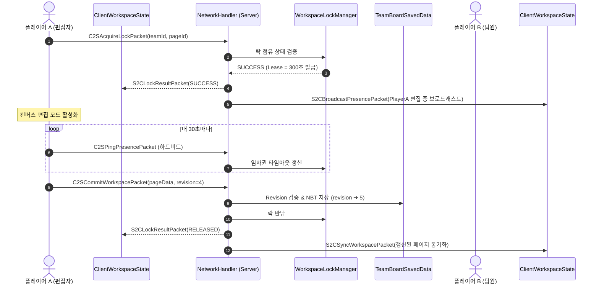
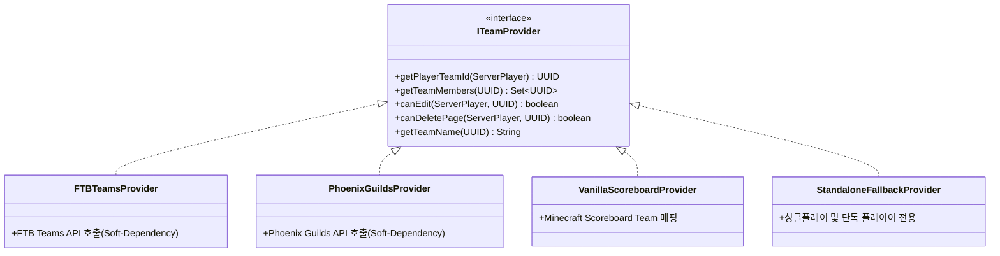

# [04] 멀티플레이어 동시성 제어 및 네트워크 프로토콜 (Multiplayer & Network)

> 📍 **GTCalcBoard 기술 명세서 시리즈**
> [[00] 시스템 개요](00_OVERVIEW.md) ➔ [[01] 코어 도메인 모델](01_CORE_DOMAIN_AND_MODELS.md) ➔ [[02] 수학 엔진 및 알고리즘](02_MATH_AND_ALGORITHMS.md) ➔ [[03] UI 및 렌더링 파이프라인](03_UI_AND_RENDERING_PIPELINE.md) ➔ **[04] 멀티플레이어 및 네트워크** ➔ [[05] 외부 연동 및 다국어](05_INTEGRATION_AND_I18N.md)

---

## 1. 네트워크 아키텍처 개요 (`com.gtceu.calcboard.network`)

GTCalcBoard v2.0.0은 Forge `SimpleChannel` (프로토콜 버전 `2.0.0`)을 기반으로 전용 양방향 패킷 파이프라인을 구축하여 멀티플레이어 팀 단위 작업 공간을 실시간 동기화합니다.



---

## 2. C2S (Client to Server) 패킷 명세

| 패킷 클래스 | 페이로드 구조 | 설명 및 서버 처리 동작 |
| :--- | :--- | :--- |
| `C2SRequestWorkspacePacket` | `UUID teamId` | 클라이언트가 특정 팀의 워크스페이스 데이터 및 페이지 목록 조회를 요청 |
| `C2SAcquireLockPacket` | `UUID teamId, String pageId` | 특정 페이지의 편집 잠금(Lock) 획득 요청 |
| `C2SReleaseLockPacket` | `UUID teamId, String pageId` | 편집 중이던 페이지의 락을 자발적으로 반납 |
| `C2SCommitWorkspacePacket` | `UUID teamId, String pageId, CompoundTag pageData, int clientRevision, String commitMessage` | 수정한 보드 페이지 데이터를 서버에 커밋 (낙관적 락 검증) |
| `C2SDeleteTeamPagePacket` | `UUID teamId, String pageId` | 팀 워크스페이스에서 특정 페이지 삭제 요청 (오피서/관리자 권한 필요) |
| `C2SPingPresencePacket` | `UUID teamId, String pageId` | 락 소유권 유지를 위한 주기적 하트비트 핑 (Lease 연장) |

---

## 3. S2C (Server to Client) 패킷 명세

| 패킷 클래스 | 페이로드 구조 | 설명 및 클라이언트 처리 동작 |
| :--- | :--- | :--- |
| `S2CSyncWorkspacePacket` | `UUID teamId, TeamWorkspaceData workspaceData` | 서버의 최신 팀 워크스페이스 전체 데이터를 클라이언트에 동기화 |
| `S2CLockResultPacket` | `UUID teamId, String pageId, boolean success, UUID lockHolder, String holderName, long expireTime` | 락 획득 성공 여부 및 현재 락 소유자 정보를 응답 |
| `S2CBroadcastPresencePacket` | `UUID teamId, Map<String, LockInfo> activeLocks` | 팀원들의 현재 편집 위치 및 락 상태를 실시간 브로드캐스트 |
| `S2CWorkspaceErrorPacket` | `String errorCode, String errorMessageKey` | 버전 충돌(Conflict), 권한 없음, 타임아웃 등의 에러 통지 및 토스트 표시 |

---

## 4. 분산 동시성 제어 및 락 메커니즘 (`WorkspaceLockManager`)

1. **임차권 기반 소프트 락 (Lease Lock)**:
   - 한 번 락을 획득하면 $300\text{초}$ ($5\text{분}$) 동안 유효합니다.
   - 클라이언트가 정상 편집 중일 때는 매 $30\text{초}$마다 `C2SPingPresencePacket`을 전송하여 임차권을 자동 연장합니다.
   - 클라이언트 크래시나 네트워크 단절 발생 시 $5\text{분}$ 후 락이 자동 해제되어 다른 팀원이 편집할 수 있습니다.
2. **낙관적 버전 번호 검증 (Revision Conflict Prevention)**:
   - 서버의 현재 페이지 `revision` 번호와 클라이언트가 제출한 `clientRevision` 번호가 정확히 일치할 때만 커밋을 승인합니다.
   - 불일치 시 `S2CWorkspaceErrorPacket`을 통해 충돌을 알리고 최신 데이터로 동기화하도록 유도합니다.
3. **개인 보드로 포크 (Fork to Personal)**:
   - 다른 팀원이 페이지를 편집 중(`🔒 잠김`)이더라도, 읽기 전용 상태에서 [개인 보드로 복사] 버튼을 눌러 내 로컬 탭으로 즉시 복제하여 독립적으로 수정할 수 있습니다.

---

## 5. 서버 영속화 및 SavedData 스키마 (`TeamBoardSavedData`)

* **저장 경로**: `<world>/data/gtcalcboard_workspaces.dat` (바닐라 `DimensionDataStorage` 메커니즘)
* **NBT 구조 명세**:

```json
{
  "Workspaces": [
    {
      "TeamId": "c1f7b029-7977-4c12-9c3f-85472149b111",
      "TeamName": "GregTech Pioneers",
      "Revision": 42,
      "Pages": [
        {
          "PageId": "page_benzene_cracking",
          "Title": "벤젠 크래킹 라인",
          "Revision": 12,
          "LastModifiedBy": "PlayerName",
          "LastModifiedTime": 1724123456789,
          "GraphNBT": {
            "Nodes": [ ... ],
            "Connections": [ ... ]
          }
        }
      ],
      "CommitLogs": [
        {
          "Timestamp": 1724123456789,
          "Author": "PlayerName",
          "Message": "HSS-E 코일 업그레이드 반영",
          "Revision": 42
        }
      ]
    }
  ]
}
```

---

## 6. 팀 프로바이더 추상화 (`ITeamProvider`)



* **`FTBTeamsProvider`**: `dev.ftb.mods.ftbteams.api.FTBTeamsAPI`를 소프트 디펜던시로 호출. 팀 오피서/소유자 권한을 판별.
* **`PhoenixGuildsProvider`**: `net.phoenixvine.guilds.GuildAPI`를 소프트 디펜던시로 호출. 길드 오피서/소유자 권한 및 멤버십 판별.
* **`VanillaScoreboardProvider`**: FTB Teams나 Phoenix Guilds가 없는 바닐라/경량 서버에서 스코어보드 팀을 기반으로 팀 격리 제공.
* **`StandaloneFallbackProvider`**: 싱글플레이 환경에서 플레이어 고유 UUID 기반으로 단독 워크스페이스 제공.

---

> ➡️ **다음 장으로 이동**: [[05] 외부 모드 연동 및 다국어 단위 시스템](05_INTEGRATION_AND_I18N.md)
