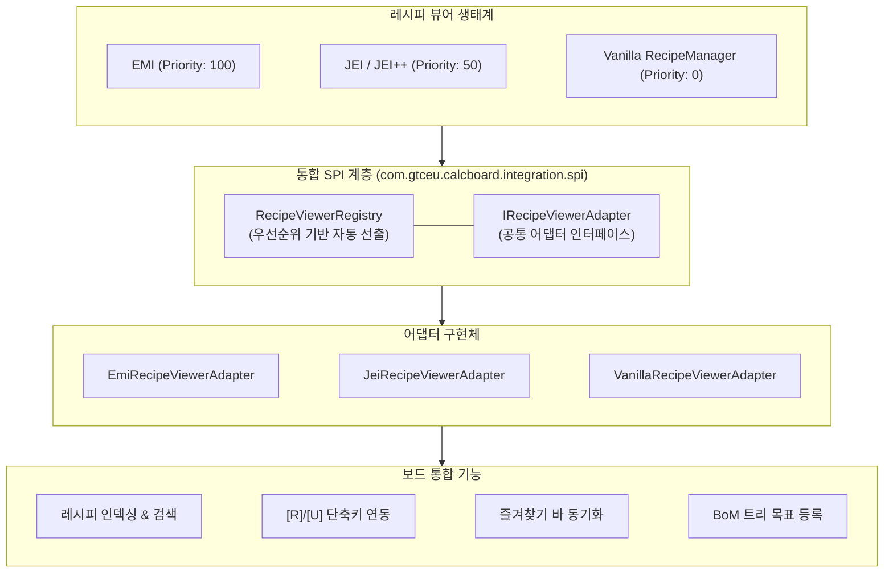
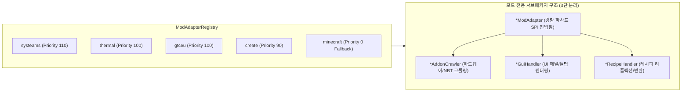

# [05] 외부 모드 연동 및 다국어 단위 시스템 (Integration & i18n)

> 📍 **GTCalcBoard 기술 명세서 시리즈**
> [[00] 시스템 개요](00_OVERVIEW.md) ➔ [[01] 코어 도메인 모델](01_CORE_DOMAIN_AND_MODELS.md) ➔ [[02] 수학 엔진 및 알고리즘](02_MATH_AND_ALGORITHMS.md) ➔ [[03] UI 및 렌더링 파이프라인](03_UI_AND_RENDERING_PIPELINE.md) ➔ [[04] 멀티플레이어 및 네트워크](04_MULTIPLAYER_AND_NETWORK_PROTOCOL.md) ➔ **[05] 외부 연동 및 다국어**

---

## 1. 통합 레시피 뷰어 SPI 시스템 (`com.gtceu.calcboard.integration.spi`)

GTCalcBoard는 클린 아키텍처 원칙에 따라 특정 레시피 뷰어에 종속되지 않고, 런타임에 설치된 모드에 맞춰 최적의 뷰어를 선출하는 **통합 레시피 뷰어 SPI (`IRecipeViewerAdapter`)**를 제공합니다.



### 1.1 `IRecipeViewerAdapter` 핵심 계약
* `getName()` / `getPriority()`: 어댑터 식별자 및 선출 우선순위.
* `isAvailable()`: 해당 레시피 뷰어 모드의 로드 여부 및 런타임 유효성 검사.
* `getAllRecipes()`: 캔버스 노드로 인스턴스화 가능한 전체 레시피 목록 추출.
* `getFavorites()`: 플레이어가 등록한 즐겨찾기/북마크 레시피 목록 실시간 동기화.
* `registerBomToRecipeTree(bomSummary, warnings)`: BoM 쇼핑 리스트를 레시피 뷰어의 트리/목표로 1클릭 등록.
* `lookupRecipe(stack)` / `lookupUsage(stack)`: `[R]`, `[U]` 단축키 호버 시 레시피/용도 조회 창 호출.

### 1.2 어댑터 구현체별 특성
* **`EmiRecipeViewerAdapter` (`integration.emi`)**:
  - EMI 공식 `EmiRecipeHandler`를 등록하여 보드가 열려 있을 때 `[+]` 버튼으로 캔버스에 직접 노드 배치.
  - `EmiFavorites.favorites` 동기화 및 `EmiRecipeTree` BoM 목표 등록.
* **`JeiRecipeViewerAdapter` (`integration.jei`)**:
  - JEI 레시피 카탈로그 인덱싱, `[R]`/`[U]` 조회, JEI 북마크 바 연동.
  - JEI++ (Just Enough Calculation) 환경에서 BoM 쇼핑 리스트 클립보드 및 트리 등록 연동.
* **`VanillaRecipeViewerAdapter` (`integration.vanilla`)**:
  - 레시피 뷰어 모드가 없는 순수 바닐라 또는 헤드리스 환경용 폴백. `RecipeManager` 기본 레시피 인덱싱 지원.

---

## 2. 모드 호환성 어댑터 시스템 (`com.gtceu.calcboard.compat`)

GTCalcBoard는 특정 모드에 종속되지 않는 독립적 확장성을 위해 **우선순위 기반 SPI(Service Provider Interface)** 라우팅 시스템을 채택하고 있으며, 단일 책임 원칙(SRP)에 따라 모드별 전용 서브패키지로 모듈화되어 있습니다.



### 2.1 패키지별 세부 구조

| 서브패키지 | 주요 컴포넌트 | 전담 역할 및 기능 |
| :--- | :--- | :--- |
| `compat.gtceu` | `GTCEuModAdapter`<br/>`GTCEuAddonCrawler`<br/>`GTCEuGuiHandler`<br/>`GTCEuRecipeHandler` | • GT 다중블록 특성 및 가열 코일/터빈 로터/병렬·유지보수 해치 크롤링<br/>• 전압 티어 및 EU/t 툴팁/미리보기 렌더링<br/>• GTRecipe 리플렉션 및 발전기/소비기 스펙 변환<br/>• 스팀 모드(LP/HP) 및 스팀 멀티블록 자동 구성 및 검증 |
| `compat.create` | `CreateModAdapter`<br/>`CreateGuiHandler`<br/>`CreateRecipeHandler` | • 키네틱 발전기(대형 수차, 풍차, 스팀 엔진 등) 가상 레시피 생성<br/>• RPM 속도 제어 버튼 및 Stress Unit (SU) 툴팁 렌더링<br/>• Create 가공 레시피 소요 시간 및 부하 변환 |
| `compat.createnewage` | `CreateNewAgeModAdapter`<br/>`CreateNewAgeGuiHandler`<br/>`CreateNewAgeRecipeHandler` | • 전기 모터(FE ➔ SU) 및 발전기(SU ➔ FE) 가상 레시피 생성<br/>• 회전력과 전력 간 변환 효율 및 전압 단계 제어 |
| `compat.thermal` | `ThermalModAdapter`<br/>`ThermalAddonCrawler`<br/>`ThermalGuiHandler`<br/>`ThermalRecipeHandler` | • 서멀 증강 및 KubeJS 커스텀 키트(`AugmentData` NBT) 크롤링<br/>• 다이내모 발전량(RF/t) 툴팁 렌더링<br/>• 서멀 다이내모 및 기계 레시피 변환 |
| `compat.systeams` | `SysteamsModAdapter`<br/>`SysteamsGuiHandler`<br/>`SysteamsRecipeHandler` | • 스팀 보일러(Steam mB/s) 및 스팀 다이내모 툴팁 렌더링<br/>• SysteamsConfig 리플렉션 기반 증기 열효율 및 생산량 변환 |
| `compat.start` | `StarTModAdapter`<br/>`StarTTurbineHelper`<br/>`StarTAddonCrawler` | • Star Technology 특수 플라즈마 터빈(SPT/NPT) 및 다중 나선 구조 지원<br/>• SPT/NPT 전용 특성 애드온 호환성 및 다중 블록 제약 검증 |
| `compat.vanilla` | `VanillaModAdapter` | • 표준 싱글블록 및 타 모드 기본 폴백 처리 |

### 2.2 `IModAdapter` 생명주기 및 핵심 책임 명세

* `onMachineIconChanged(node, oldIcon, newIcon)`: 머신 아이콘 전환 시 멀티블록 플래그, 스팀 모드, 기본 병렬 수치(8x 등) 자동 조정 및 슬롯 동기화.
* `getEnergyType(node)`: 노드의 에너지 형태(`ELECTRIC_EU`, `KINETIC_SU`, `ELECTRIC_FE`, `HEAT_OR_SELF`, `NONE`) 결정.
* `computeOverclock(node, targetTier, isGenerator)`: 전압 오버클럭, 서브틱 CPS, 로터 효율, 코일 온도 할인, 증강 장치 배수 연산.
* `validateNode(node, graph, warnings)`: 반사판 요구 티어, 터빈 유량 결손, 해치/버스 슬롯 및 용량 제약 연역 검증.
* `buildMultiblockBOM(node, warnings)`: 멀티블록 청사진 기반 필요 블록 수량 및 오버라이드 해치 BOM 산출.

### 2.3 연역적 분석 원칙 (Rule 5: Deductive Analysis Policy)

* **휴리스틱 금지**: 아이템 이름, 툴팁 텍스트, 아이템 ID 경로 문자열 매칭(`id.getPath().contains(...)`)을 통한 스펙 추론을 엄격히 배제.
* **결정론적 데이터 획득**:
  1. 공식 모드 API 및 런타임 Java 리플렉션을 통한 기능적 연역.
  2. 모드 내부 시뮬레이션 및 동작 파라미터 직접 추출.
  3. 결정론적 NBT 수치 데이터 구조(예: `AugmentData` 내 순수 Float/Int 태그) 및 공식 `TagKey` 직접 검사.

### 2.4 크롤러 오케스트레이션 및 비활성 아이템 자동 정리 (`DynamicAddonCrawler`)
* **활성 스택 일괄 수집**: EMI 인덱스(`EmiApi.getIndexStacks()`) 및 인게임 레시피 매니저(`mc.level.getRecipeManager()`)를 순회하여 현재 게임 내에 실제로 활성화된 모든 `ItemStack`과 커스텀 NBT를 수집.
* **어댑터 위임**: 수집된 활성 스택을 각 모드 어댑터의 `discoverAddons(collector, activeStacks)`로 전달하여 모듈별로 크롤링.
* **비활성 아이템 자동 제거 (Pruning)**: 모드팩에서 레시피를 삭제하거나 EMI에서 숨긴 아이템(예: 기본 서멀 업그레이드 키트 등)은 카탈로그에서 자동으로 제외되어 깨끗한 설정창을 보장.

---

## 3. 시간 단위 환산 시스템 (`RateTimeUnit`)

아이템 및 유체 흐름률을 다양한 시간 단위로 스케일링하여 표기할 수 있습니다.

| 열거형 상수 | 접미사 | 환산 계수 ($F$) | 다국어 키 | 기준 설명 |
| :--- | :--- | :--- | :--- | :--- |
| `PER_TICK` | `/t` | $0.05$ | `gui.gtcalcboard.unit.per_tick` | 틱당 유량 (초당 20틱 기준) |
| `PER_SECOND` | `/s` | $1.0$ | `gui.gtcalcboard.unit.per_second` | 초당 유량 (기본 기준 단위) |
| `PER_MINUTE` | `/min` | $60.0$ | `gui.gtcalcboard.unit.per_minute` | 분당 유량 |
| `PER_HOUR` | `/h` | $3600.0$ | `gui.gtcalcboard.unit.per_hour` | 시간당 유량 |
| `PER_DAY` | `/d` | $86400.0$ | `gui.gtcalcboard.unit.per_day` | 일단위 유량 |

### 3.1 단위 변환 공식
$$\text{Displayed Rate} = \text{Base Rate (per second)} \times \text{RateTimeUnit.getFactor}()$$

---

## 4. 수치 포맷팅 규격 (`FormatUtil`)

사용자 친화적인 수치 가독성을 위해 다음과 같은 접두사 규칙을 적용합니다:

### 4.1 EU/t 전력 표기 규칙
* $0 \dots 999$: 소수점 1자리 (`120.0 EU/t`)
* $1,000 \dots 999,999$: `k` 접두사 (`1.25k EU/t`)
* $1,000,000 \dots 999,999,999$: `M` 접두사 (`4.50M EU/t`)
* $1,000,000,000$ 이상: `G` 접두사 (`12.00G EU/t`)

### 4.2 흐름률(Flow Rate) 및 전역 유체 단위 (`FluidUnitMode`)
* **아이템**: 정수 또는 소수점 2자리 (`2.50 /s`)
* **전역 유체 단위 모드 (`FluidUnitMode`)**:
  - `AUTO` (기본값): 유량 수치에 따라 자동 단위 변환 ($< 1,000\text{ mB}$는 $\text{mB/s}$, $\ge 1,000\text{ mB}$는 $\text{B/s}$).
  - `ALWAYS_MB`: 모든 유체를 밀리버킷 단위로 일괄 통일 표기 (`500 mB/s`, `2500 mB/s`, `0.10 mB/s`).
  - `ALWAYS_B`: 모든 유체를 버킷 단위로 일괄 통일 표기 (`0.50 B/s`, `2.50 B/s`, `0.0001 B/s`).
* **조작 및 영속화**: 상단 툴바의 유체 단위 버튼(`Shift+T`)으로 실시간 순환 전환되며 클라이언트 설정에 자동 영속화.

---

## 5. 다국어(i18n) 키 명명 규칙 및 동기화

모든 UI 텍스트는 `ko_kr.json` 및 `en_us.json` 언어 리소스 파일에 상호 1:1로 동기화되어 관리됩니다.

```json
{
  "gui.gtcalcboard.title": "GT Calculator Board",
  "gui.gtcalcboard.tab.personal": "개인 보드",
  "gui.gtcalcboard.tab.team": "팀 보드",
  "gui.gtcalcboard.unit.per_second": "초당 (/s)",
  "gui.gtcalcboard.dialog.machine_config.title": "기계 공정 설정",
  "gui.gtcalcboard.dialog.dashboard.title": "전역 공정 수지 대시보드",
  "gui.gtcalcboard.toast.lock_acquired": "편집 락을 획득했습니다.",
  "gui.gtcalcboard.toast.conflict": "다른 팀원에 의해 보드가 수정되었습니다."
}
```

---

> 🏠 **처음으로 돌아가기**: [[00] 시스템 아키텍처 개요 및 설계 원칙](00_OVERVIEW.md)  
> 📑 **전체 목차 인덱스**: [CODE_SPECIFICATION.md](../CODE_SPECIFICATION.md)
