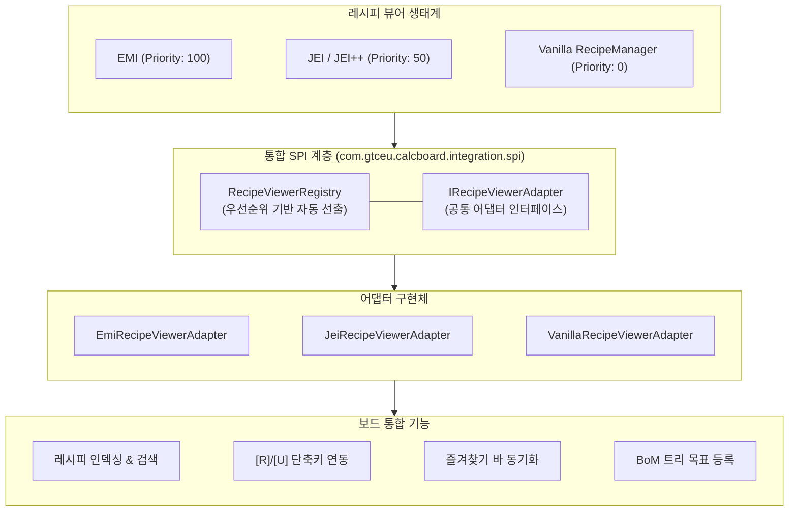
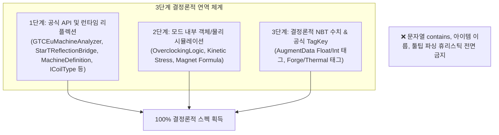

# [05] 외부 모드 연동 및 다국어 단위 시스템 (Integration & i18n)

> 📍 **GTCalcBoard 기술 명세서 시리즈**
> [[00] 시스템 개요](00_OVERVIEW.md) ➔ [[01] 코어 도메인 모델](01_CORE_DOMAIN_AND_MODELS.md) ➔ [[02] 수학 엔진 및 알고리즘](02_MATH_AND_ALGORITHMS.md) ➔ [[03] UI 및 렌더링 파이프라인](03_UI_AND_RENDERING_PIPELINE.md) ➔ [[04] 멀티플레이어 및 네트워크](04_MULTIPLAYER_AND_NETWORK_PROTOCOL.md) ➔ **[05] 외부 연동 및 다국어**

---

## 1. 통합 레시피 뷰어 SPI 시스템 (`com.gtceu.calcboard.integration.spi`)

GTCalcBoard는 클린 아키텍처 원칙에 따라 특정 레시피 뷰어에 종속되지 않고, 런타임에 설치된 모드에 맞춰 최적의 뷰어를 선출하는 **통합 레시피 뷰어 SPI (`IRecipeViewerAdapter`)**를 제공합니다.



### 1.1 `IRecipeViewerAdapter` 핵심 계약
* `getName()` / `getPriority()`: 어댑터 식별자 및 선출 우선순위.
* `isAvailable()`: 해당 레시피 뷰어 모드의 로드 여부 및 런타임 유효성 검사.
* `getAllRecipes()`: 캔버스 노드로 인스턴스화 가능한 전체 레시피 목록 추출.
* `getFavorites()`: 플레이어가 등록한 즐겨찾기/북마크 레시피 목록 실시간 동기화.
* `registerBomToRecipeTree(bomSummary, warnings)`: BoM 쇼핑 리스트를 레시피 뷰어의 트리/목표로 1클릭 등록.
* `lookupRecipe(stack)` / `lookupUsage(stack)`: `[R]`, `[U]` 단축키 호버 시 레시피/용도 조회 창 호출.

---

## 2. 모드 호환성 어댑터 시스템 (`com.gtceu.calcboard.compat`)

GTCalcBoard는 특정 모드에 종속되지 않는 독립적 확장성을 위해 **우선순위 기반 SPI(Service Provider Interface)** 라우팅 시스템을 채택하고 있으며, 전용 서버 크래시를 원천 차단하기 위해 **공용 연산 계층(`compat.*`)과 클라이언트 GUI 계층(`client.gui.compat.*`)을 완벽히 분리**하였습니다.

```mermaid
graph LR
    subgraph Registry["ModAdapterRegistry (Server & Client 공용)"]
        direction TB
        R_SYS["systeams (Priority 110)"]
        R_START["start (Priority 105)"]
        R_NA["createnewage (Priority 105)"]
        R_TH["thermal (Priority 100)"]
        R_GT["gtceu (Priority 100)"]
        R_CR["create (Priority 90)"]
        R_VAN["minecraft (Priority 0 Fallback)"]
    end

    subgraph CoreAdapters["순수 공용 어댑터 계층 (헤드리스 100% 안전)"]
        GT_AD["GTCEuModAdapter<br/>- physics.GTBoilerPhysics<br/>- physics.GTTurbinePhysics<br/>- physics.GTMultiblockBOMResolver"]
        CR_AD["CreateModAdapter"]
        CNA_AD["CreateNewAgeModAdapter"]
        TH_AD["ThermalModAdapter"]
        SYS_AD["SysteamsModAdapter"]
        STR_AD["StarTModAdapter"]
        VAN_AD["VanillaModAdapter"]
    end

    subgraph ClientGui["클라이언트 전용 GUI 계층 (@OnlyIn Dist.CLIENT)"]
        GUI_REG["ModGuiHandlerRegistry"]
        GT_GUI["GTCEuModGuiHandler"]
        CR_GUI["CreateModGuiHandler"]
        CNA_GUI["CreateNewAgeModGuiHandler"]
        TH_GUI["ThermalModGuiHandler"]
        SYS_GUI["SysteamsModGuiHandler"]
    end

    Registry --> CoreAdapters
    CoreAdapters -.-> ClientGui
```



### 2.1 7대 모드 어댑터 명세

| 서브패키지 | 주요 컴포넌트 | 전담 역할 및 기능 |
| :--- | :--- | :--- |
| `compat.gtceu` | `GTCEuModAdapter`<br/>`helper.GTCEuMachineAnalyzer`<br/>`helper.GTCEuReflectionBridge`<br/>`physics.GTBoilerPhysics`<br/>`physics.GTTurbinePhysics`<br/>`physics.GTMultiblockBOMResolver`<br/>`helper.* (Coil, Parallel, Reflector, Hatch)` | • `GTCEuMachineAnalyzer`: 단일 진실 공급원(SSOT) 기반 기계/멀티블록 능력 및 특성 결정론적 분석<br/>• GT 멀티블록 물리, 발열 코일/터빈 로터/병렬·유지보수 해치 연역<br/>• 전압 티어 오버클럭 및 순수 헤드리스 툴팁 데이터 생성<br/>• 스팀 모드(LP/HP) 및 멀티블록 자동 구성 및 제약 검증<br/>• 멀티블록 청사진 기반 BOM 및 해치 오버라이드 산출 |
| `compat.create` | `CreateModAdapter`<br/>`CreateRecipeHandler`<br/>`CreateSequencedRecipeExtractor` | • 키네틱 발전기(대형 수차, 풍차, 스팀 엔진 등) 가상 레시피 생성<br/>• `CreateSequencedRecipeExtractor`: 순차 조립 단계별 기계 아이콘(Deployer, Spout, Press, Saw) 개별 추출<br/>• RPM 속도 제어 및 Stress Unit (SU) 물리 연산 |
| `compat.createnewage` | `CreateNewAgeModAdapter`<br/>`CreateNewAgeRecipeHandler` | • 전기 모터(FE ➔ SU) 및 발전기(SU ➔ FE) 가상 레시피 생성<br/>• 자석 강도 합성 및 회전력/전력 상호 변환 효율 연산 |
| `compat.thermal` | `ThermalModAdapter`<br/>`ThermalAugmentHelper`<br/>`ThermalRecipeHandler` | • 써멀 증강 및 커스텀 키트(`AugmentData` NBT) 연역 추출<br/>• 다이내모 발전량(RF/t) 및 기계 소요 시간 계수 합성 |
| `compat.systeams` | `SysteamsModAdapter`<br/>`SysteamsRecipeHandler` | • 스팀 보일러(Steam mB/s) 및 스팀 다이내모 툴팁/수지 연산<br/>• 복합 연료 증기 열효율 및 생산량 변환 |
| `compat.start` | `StarTModAdapter`<br/>`StarTReflectionBridge`<br/>`StarTTurbineHelper` | • `StarTReflectionBridge`: Star Technology Core 레시피 모디파이어 및 기계 능력 격리 연역<br/>• Star Technology 초고압 플라즈마 터빈(SPT/NPT) 및 다중 나선 구조 지원<br/>• SPT/NPT 전용 특성 애드온 호환성 및 멀티블록 제약 검증 |
| `compat.vanilla` | `VanillaModAdapter` | • 표준 싱글블록 및 비특화 모드 기본 폴백 처리 |

---

## 3. 연역적 분석 원칙 (Rule 5: Deductive Analysis Policy)

GTCalcBoard는 모드팩 커스텀 환경에서의 안정성을 위해 3단계 결정론적 연역 체계를 엄격히 준수합니다.



---

## 4. 시간 단위 환산 시스템 (`RateTimeUnit`)

아이템 및 유체 흐름률을 다양한 시간 단위로 스케일링하여 표기할 수 있습니다.

| 열거형 상수 | 접미사 | 환산 계수 ($F$) | 다국어 키 | 기준 설명 |
| :--- | :--- | :--- | :--- | :--- |
| `PER_TICK` | `/t` | $0.05$ | `gui.gtcalcboard.unit.per_tick` | 틱당 유량 (초당 20틱 기준) |
| `PER_SECOND` | `/s` | $1.0$ | `gui.gtcalcboard.unit.per_second` | 초당 유량 (기본 기준 단위) |
| `PER_MINUTE` | `/min` | $60.0$ | `gui.gtcalcboard.unit.per_minute` | 분당 유량 |
| `PER_HOUR` | `/h` | $3600.0$ | `gui.gtcalcboard.unit.per_hour` | 시간당 유량 |
| `PER_DAY` | `/d` | $86400.0$ | `gui.gtcalcboard.unit.per_day` | 일단위 유량 |

---

## 5. 수치 포맷팅 규격 및 전역 유체 단위 (`FormatUtil`, `NumberFormatUtil`)

### 5.1 전력 표기 접두사
- $0 \dots 999$: 소수점 1자리 (`120.0 EU/t`)
- $1,000 \dots 999,999$: `k` 접두사 (`1.25k EU/t`)
- $1,000,000 \dots 999,999,999$: `M` 접두사 (`4.50M EU/t`)
- $1,000,000,000$ 이상: `G` 접두사 (`12.00G EU/t`)

### 5.2 전역 유체 단위 모드 (`FluidUnitMode`)
- `AUTO` (기본값): 수치에 따라 자동 변환 ($< 1,000\text{ mB}$는 $\text{mB/s}$, $\ge 1,000\text{ mB}$는 $\text{B/s}$).
- `ALWAYS_MB`: 모든 유체를 밀리버킷 단위로 일괄 통일 (`500 mB/s`, `2500 mB/s`).
- `ALWAYS_B`: 모든 유체를 버킷 단위로 일괄 통일 (`0.50 B/s`, `2.50 B/s`).

---

## 6. 다국어(i18n) 키 명명 규칙 및 3개 국어 동기화

모든 UI 텍스트는 한국어(`ko_kr.json`), 영어(`en_us.json`), 간체 중국어(`zh_cn.json`) 언어 리소스 파일에 상호 1:1로 동기화되어 관리됩니다.

```json
{
  "gui.gtcalcboard.title": "GT Calculator Board",
  "gui.gtcalcboard.tab.personal": "개인 보드",
  "gui.gtcalcboard.tab.team": "팀 보드",
  "gui.gtcalcboard.unit.per_second": "초당 (/s)",
  "gui.gtcalcboard.dialog.machine_config.title": "기계 공정 설정",
  "gui.gtcalcboard.dialog.dashboard.title": "전역 공정 수지 대시보드",
  "gui.gtcalcboard.toast.lock_acquired": "편집 락을 획득했습니다.",
  "gui.gtcalcboard.toast.conflict": "다른 팀원에 의해 보드가 수정되었습니다."
}
```

---

> 🏠 **처음으로 돌아가기**: [[00] 시스템 아키텍처 개요 및 설계 원칙](00_OVERVIEW.md)  
> 📑 **전체 목차 인덱스**: [CODE_SPECIFICATION.md](../CODE_SPECIFICATION.md)
