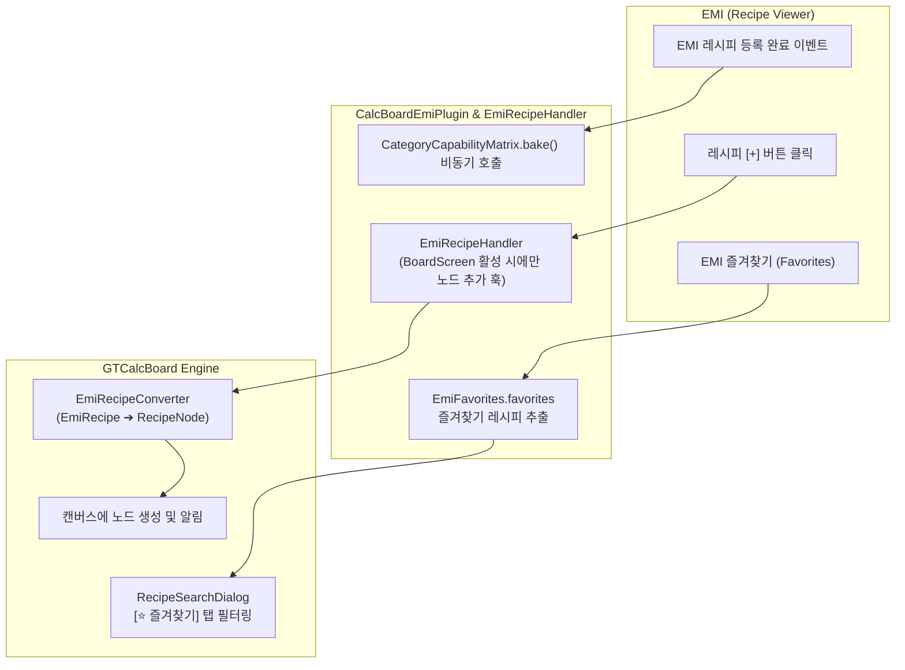

# [05] 외부 모드 연동 및 다국어 단위 시스템 (Integration & i18n)

> 📍 **GTCalcBoard 기술 명세서 시리즈**
> [[00] 시스템 개요](00_OVERVIEW.md) ➔ [[01] 코어 도메인 모델](01_CORE_DOMAIN_AND_MODELS.md) ➔ [[02] 수학 엔진 및 알고리즘](02_MATH_AND_ALGORITHMS.md) ➔ [[03] UI 및 렌더링 파이프라인](03_UI_AND_RENDERING_PIPELINE.md) ➔ [[04] 멀티플레이어 및 네트워크](04_MULTIPLAYER_AND_NETWORK_PROTOCOL.md) ➔ **[05] 외부 연동 및 다국어**

---

## 1. EMI 레시피 뷰어 연동 (`com.gtceu.calcboard.integration.emi`)

GTCalcBoard는 EMI(Recipe Viewer)와의 긴밀한 연동을 통해 인게임 레시피 검색과 공식 [+] 버튼 훅, 즐겨찾기 연동을 지원합니다.



### 1.1 `CalcBoardEmiPlugin` (플러그인 라이프사이클 및 [+] 훅)
* `dev.emi.emi.api.EmiPlugin` 인터페이스 구현체.
* EMI가 전체 레시피를 로드한 직후 `CategoryCapabilityMatrix.bake(recipeManager)`를 비동기로 호출하여 $O(1)$ 수용 능력 매트릭스를 사전 빌드.
* **공식 `EmiRecipeHandler` 등록**:
  - `supportsRecipe(recipe)`: 모든 `EmiRecipe` 지원.
  - `canCraft(recipe, context)`: 현재 클라이언트의 화면이 `BoardScreen`일 때만 활성화 (`true`).
  - `craft(recipe, context)`: 일반 인벤토리/제작대 동작을 침범하지 않고, 보드가 열려 있을 때만 활성 보드에 노드를 즉시 배치하고 토스트 알림 출력.

### 1.2 `RecipeSearchDialog`의 EMI 즐겨찾기(Favorites) 연동
* `dev.emi.emi.registry.EmiFavorites.favorites`로부터 플레이어가 `A` 키나 북마크로 등록해 둔 레시피 목록을 실시간으로 획득.
* 레시피 검색창 상단의 `[⭐ 즐겨찾기]` 토글 버튼을 통해 즐겨찾기된 레시피만 1클릭으로 조회 및 배치 가능.

### 1.3 `EmiRecipeConverter` (레시피 변환기)
* `EmiRecipe` 인스턴스로부터 입력/출력 `EmiIngredient`를 추출.
* 아이템/유체 식별자, 수량, 확률, 전압 티어, 소요 틱을 파싱하여 순수 도메인 모델인 `RecipeNode`로 인스턴스화.
* `CategoryCapabilityMatrix`로부터 연역된 워크스테이션 블록 목록 및 멀티블록 속성을 노드에 즉시 바인딩.

---

## 2. 시간 단위 환산 시스템 (`RateTimeUnit`)

아이템 및 유체 흐름률을 다양한 시간 단위로 스케일링하여 표기할 수 있습니다.

| 열거형 상수 | 접미사 | 환산 계수 ($F$) | 다국어 키 | 기준 설명 |
| :--- | :--- | :--- | :--- | :--- |
| `PER_TICK` | `/t` | $0.05$ | `gui.gtcalcboard.unit.per_tick` | 틱당 유량 (초당 20틱 기준) |
| `PER_SECOND` | `/s` | $1.0$ | `gui.gtcalcboard.unit.per_second` | 초당 유량 (기본 기준 단위) |
| `PER_MINUTE` | `/min` | $60.0$ | `gui.gtcalcboard.unit.per_minute` | 분당 유량 |
| `PER_HOUR` | `/h` | $3600.0$ | `gui.gtcalcboard.unit.per_hour` | 시간당 유량 |
| `PER_DAY` | `/d` | $86400.0$ | `gui.gtcalcboard.unit.per_day` | 일단위 유량 |

### 2.1 단위 변환 공식
$$\text{Displayed Rate} = \text{Base Rate (per second)} \times \text{RateTimeUnit.getFactor}()$$

---

## 3. 수치 포맷팅 규격 (`FormatUtil`)

사용자 친화적인 수치 가독성을 위해 다음과 같은 접두사 규칙을 적용합니다:

### 3.1 EU/t 전력 표기 규칙
* $0 \dots 999$: 소수점 1자리 (`120.0 EU/t`)
* $1,000 \dots 999,999$: `k` 접두사 (`1.25k EU/t`)
* $1,000,000 \dots 999,999,999$: `M` 접두사 (`4.50M EU/t`)
* $1,000,000,000$ 이상: `G` 접두사 (`12.00G EU/t`)

### 3.2 흐름률(Flow Rate) 표기 규칙
* 아이템: 정수 또는 소수점 2자리 (`2.50 /s`)
* 유체: 밀리버킷(`mB`) 단위 표기 (`1,000 mB/s`)

---

## 4. 다국어(i18n) 키 명명 규칙 및 동기화

모든 UI 텍스트는 `ko_kr.json` 및 `en_us.json` 언어 리소스 파일에 상호 1:1로 동기화되어 관리됩니다.

```json
{
  "gui.gtcalcboard.title": "GT Calculator Board",
  "gui.gtcalcboard.tab.personal": "개인 보드",
  "gui.gtcalcboard.tab.team": "팀 보드",
  "gui.gtcalcboard.unit.per_second": "초당 (/s)",
  "gui.gtcalcboard.dialog.machine_config.title": "기계 공정 설정",
  "gui.gtcalcboard.dialog.dashboard.title": "전역 공정 수지 대시보드",
  "gui.gtcalcboard.toast.lock_acquired": "편집 락을 획득했습니다.",
  "gui.gtcalcboard.toast.conflict": "다른 팀원에 의해 보드가 수정되었습니다."
}
```

---

> 🏠 **처음으로 돌아가기**: [[00] 시스템 아키텍처 개요 및 설계 원칙](00_OVERVIEW.md)  
> 📑 **전체 목차 인덱스**: [CODE_SPECIFICATION.md](../CODE_SPECIFICATION.md)
