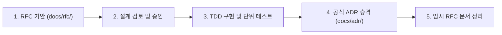

# 활성 아키텍처 제안 (Active RFCs)

본 디렉터리는 **GregTech Calculator Board (GTCalcBoard)**의 새로운 주요 기능 기획, 아키텍처 대안 탐색 및 승인을 위한 **과도기적 제안 문서(Request for Comments, RFC)** 보관소입니다.

---

## 🏛 RFC 생명주기 및 승격 규칙 (Lifecycle & Promotion)

1. **기안 (`PROPOSED`)**: 새로운 주요 기능이나 아키텍처 개편을 추진할 때 `RFC_<NUMBER>_<NAME>.md` 형식으로 작성합니다.
2. **승인 (`ACCEPTED`)**: 설계 리뷰를 거쳐 구현 목표 버전과 방향이 확정됩니다.
3. **구현 및 승격 (`docs/adr/`)**:
   - 단위 테스트 통과 및 기능 구현이 완료되면 공식 **아키텍처 결정 기록(ADR)**으로 승격되어 [`docs/adr/`](../adr/)에 영구 보존됩니다.
   - 승격 상세 절차는 [`.agents/skills/rfc-implementation/SKILL.md`](../../.agents/skills/rfc-implementation/SKILL.md)를 참조하십시오.

---

## 📋 현재 활성 RFC 목록

| 문서 번호 | RFC 제목 | 상태 (Status) | 목표 버전 | 기안일 | 핵심 제안 요약 |
| :---: | :--- | :---: | :---: | :---: | :--- |
| **[RFC-013](RFC_013_MODULAR_COMBUSTION_COMPLEX_INTEGRATION.md)** | Star Technology 모듈러 연소 복합체(Modular Combustion Complex) 및 프레임 부스팅 발전 시스템 통합 명세 | 🟡 `PARTIALLY_IMPLEMENTED` | `v2.2.0` | 2026-09-02 | Trait 기반 물리/승수(5A~12A, 냉각 1.2x/1.4x) 및 머신 설정 UI 통합 완료(Phase 1), 부수 유체 입력 주입 대기(Phase 2) |
