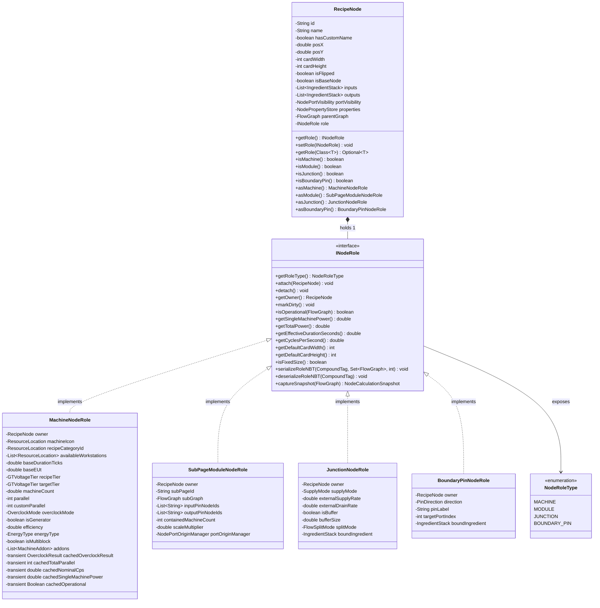
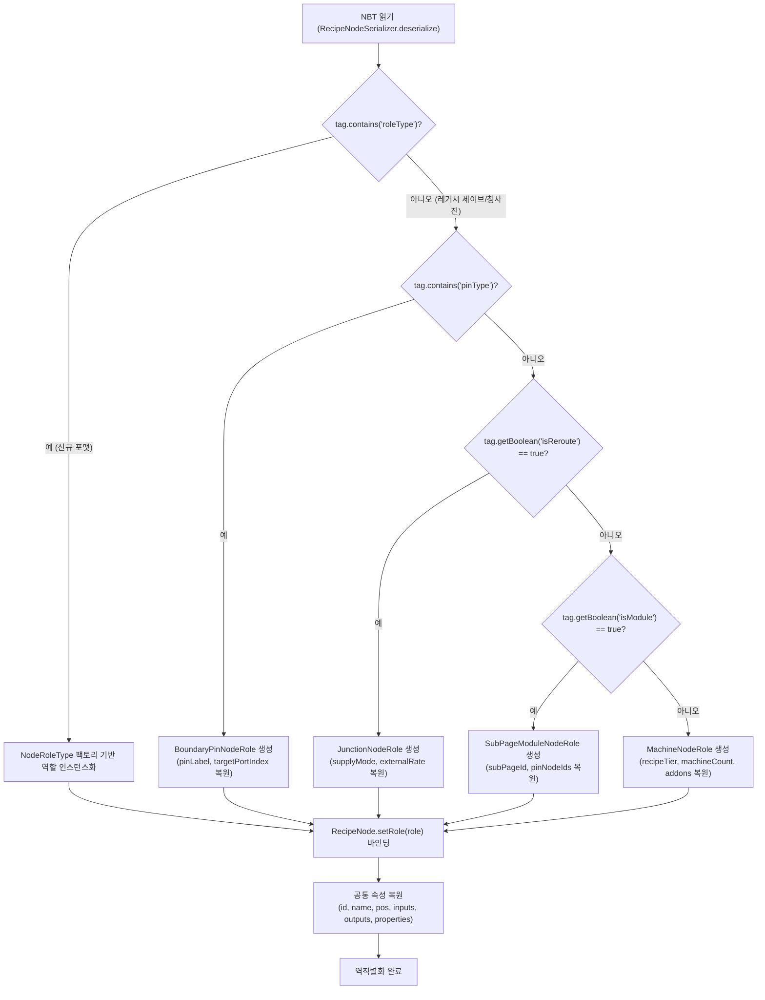
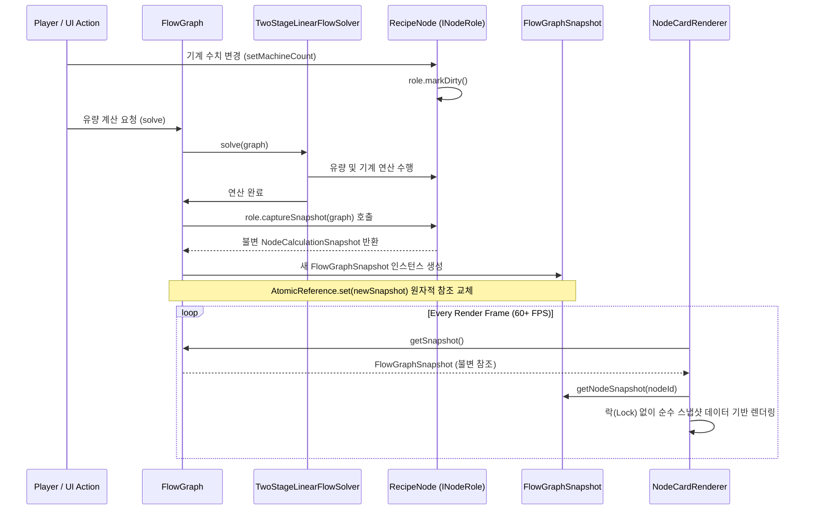
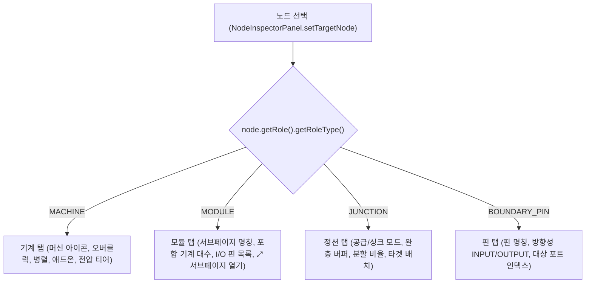
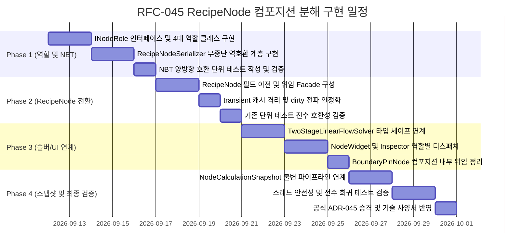

# RFC-045: RecipeNode 역할 컴포지션 분해 및 불변 계산 스냅샷 아키텍처 명세
# (RecipeNode Role Composition Decomposition & Immutable Calculation Snapshot Architecture Specification)

- **문서 번호**: RFC-045
- **대상 버전**: `v2.3.0`
- **상태**: `PROPOSED`
- **작성일**: 2026-09-11
- **최종 갱신일**: 2026-09-11
- **주관 계층**: Pure Domain Layer (`api.model`, `api.model.role`), Storage Layer (`api.storage`), Solver Layer (`api.solver`), Client GUI Layer (`client.gui.*`), Network Layer (`network.packet.*`)

---

## 1. 개요 및 배경 (Motivation)

### 1.1 현황 분석: `RecipeNode.java`의 비대화 및 다중 책임 집중
`GregTech Calculator Board`의 핵심 도메인 모델인 [`RecipeNode.java`](file:///d:/dev-ssd/modding/minecraft/GregTechCalculatorBoard/src/main/java/com/gtceu/calcboard/api/model/RecipeNode.java)는 과거 리팩토링([ADR-004](file:///d:/dev-ssd/modding/minecraft/GregTechCalculatorBoard/docs/adr/ADR_004_CLEAN_ARCHITECTURE_AND_DOMAIN_DECOMPOSITION.md), [ADR-040](file:///d:/dev-ssd/modding/minecraft/GregTechCalculatorBoard/docs/adr/ADR_040_RUNTIME_CONCURRENCY_REFLECTION_AND_GOD_CLASS_DECOMPOSITION.md))을 통해 정적 헬퍼 유틸리티(`NodeSteamHelper`, `NodeJunctionHelper`, `NodePerformanceHelper` 등)로 일부 로직을 분리하였으나, 여전히 단일 클래스에 680줄 이상의 코드와 40여 개의 필드가 집중되어 있습니다.

현재 `RecipeNode` 내부에는 캔버스 상에서 상이한 생명주기와 동작 특성을 갖는 4가지 노드 유형이 공존하고 있습니다:
1. **일반 기계 노드 (Standard Machine)**: 레시피 물리학, 전압 티어, 오버클럭, 가동률, 하드웨어 애드온, 멀티블록 구조 검증을 수행.
2. **복합 서브페이지 모듈 (SubPage Composite Module, [ADR-043](file:///d:/dev-ssd/modding/minecraft/GregTechCalculatorBoard/docs/adr/ADR_043_DEDICATED_SUBPAGE_COMPOSITE_MODULE_AND_BOUNDARY_IO.md))**: 1:1 전용 서브페이지의 종합 유량을 집계하여 외부 포트로 노출하고 비파괴 내비게이션을 담당.
3. **정션/리라우트 노드 (Junction / Reroute, [ADR-012](file:///d:/dev-ssd/modding/minecraft/GregTechCalculatorBoard/docs/adr/ADR_012_BOARD_USABILITY_AND_PRECISION_FLOW_MODELING.md), [ADR-034](file:///d:/dev-ssd/modding/minecraft/GregTechCalculatorBoard/docs/adr/ADR_034_JUNCTION_BUFFER_AND_ANCHOR_SYSTEM.md), [ADR-041](file:///d:/dev-ssd/modding/minecraft/GregTechCalculatorBoard/docs/adr/ADR_041_JUNCTION_EQUAL_AND_PRIORITY_SPLITTING.md))**: 배선 정리, 외부 공급원/싱크, 완충 버퍼 및 균등/우선순위 유량 분배를 담당하는 32x32 크기의 경량 분기점.
4. **경계 I/O 핀 노드 (Boundary Pin Node, [ADR-043](file:///d:/dev-ssd/modding/minecraft/GregTechCalculatorBoard/docs/adr/ADR_043_DEDICATED_SUBPAGE_COMPOSITE_MODULE_AND_BOUNDARY_IO.md))**: 서브페이지 경계에서 상위 모듈 카드 포트와의 1:1 바인딩 계약을 담당.

### 1.2 문제점 분석

#### 1) 더미 필드(Dummy Fields) 및 불필요한 메모리 할당
* 정션 노드(`isReroute = true`)는 기계 연산과 무관함에도 `baseDurationTicks`, `baseEUt`, `recipeTier`, `targetTier`, `machineCount`, `parallel`, `overclockMode`, `addons`, `availableWorkstations`, `recipeCategoryId` 등의 필드를 메모리에 강제 할당받습니다.
* 서브페이지 모듈(`isModule = true`) 역시 단일 기계 하드웨어 속성이 불필요함에도 관련 필드를 모두 유지합니다.
* `BoundaryPinNode`의 경우 `RecipeNode`를 직접 상속(`extends RecipeNode`)하고 있어 600줄 이상의 기계/오버클럭 로직과 필드를 상속받고 있습니다.

#### 2) 불리언 플래그 기반 제어 흐름 분기
* `isReroute`, `isModule`, `isGenerator` 등 노드의 성격을 결정하는 플래그들이 개별 필드로 분산되어 있습니다.
* 이에 따라 계산 솔버, 렌더러, 직렬화기 곳곳에서 `if (node.isReroute()) ... else if (node.isModule()) ...` 형태의 분기가 반복되어 단일 책임 원칙(SRP)과 개방-폐쇄 원칙(OCP)을 저해합니다.

#### 3) 7개 가변 transient 캐시와 동시성 취약성
* `cachedOverclockResult`, `overclockDirty`, `cachedModAdapter`, `cachedTotalParallel`, `cachedNominalCps`, `cachedSingleMachinePower`, `cachedOperational` 등 7개의 transient 캐시가 `RecipeNode` 내부에 가변 상태로 유지됩니다.
* 백그라운드 솔버 스레드와 클라이언트 GUI 렌더링 스레드가 동일한 인스턴스의 캐시를 동시에 참조하거나 무효화(`markOverclockDirty()`)할 때 데이터 레이스 및 렌더링 깜빡임 현상이 유발될 수 있습니다.

### 1.3 핵심 목표 (Goals)
1. **역할 컴포지션(Role Composition) 분리**: `RecipeNode`는 캔버스 상의 순수 그래프 엔티티(식별자, 좌표, 입출력 포트 스트림, 가시성, 토폴로지 앵커)로 슬림화하고, 고유 동작은 `INodeRole` 인터페이스 기반의 컴포넌트로 분리합니다.
2. **NBT 무손실 하위 호환성 유지**: 기존 월드 세이브 데이터 및 청사진(Blueprint) NBT 구조와의 1:1 무손실 역호환성을 보장합니다.
3. **불변 계산 스냅샷(`NodeCalculationSnapshot`) 연계**: 연산 결과 데이터를 불변 레코드로 캡처하여 UI 렌더링과 솔버 간의 스레드 안전성을 확보합니다.
4. **점진적 마이그레이션 지원**: 기존 코드베이스(UI, 솔버, 호환성 계층)의 컴파일 브레이킹을 방지하기 위해 `RecipeNode`에 위임 Facade 메서드를 유지합니다.

---

## 2. 핵심 유저 스토리 (User Stories)

| 구분 | 플레이어 및 시스템 액션 | 기대 결과 |
|---|---|---|
| **US-01** | 플레이어가 일반 기계 노드를 캔버스에 배치하고 레시피/오버클럭을 설정함 | `MachineNodeRole`을 통해 오버클럭, 병렬, 하드웨어 애드온이 정상 연산되며 기존과 동일한 조작성을 유지함 |
| **US-02** | 플레이어가 배선 분기용 정션 노드를 생성함 | `JunctionNodeRole`이 장착되어 불필요한 기계/오버클럭 필드 없이 경량 상태로 생성되며 완충 및 분할 설정이 독립 관리됨 |
| **US-03** | 플레이어가 다수 노드를 복합 서브페이지 모듈로 묶음 (`Ctrl+Shift+G`) | `SubPageModuleNodeRole`이 장착되어 서브페이지 연결 및 I/O 핀 집계가 전용 인터페이스로 캡슐화됨 |
| **US-04** | 플레이어가 서브페이지 내에 경계 I/O 핀 노드를 배치함 | `BoundaryPinNodeRole`이 장착되어 기계 설정 UI 접근이 차단되고 핀 라벨 및 포트 인덱스만 간결히 관리됨 |
| **US-05** | 이전 버전(`v2.0`~`v2.2`)에서 저장된 월드 세이브 또는 청사진 NBT를 불러옴 | `RecipeNodeSerializer`의 역호환 매핑 계층이 기존 태그를 감지하여 적절한 `INodeRole` 구현체로 자동 복원함 |
| **US-06** | 대규모 공정 계산 중 UI 캔버스를 이동하거나 확대/축소함 | 솔버가 생성한 불변 계산 스냅샷을 렌더러가 참조하여 연산 도중 캐시 무효화로 인한 화면 떨림이 발생하지 않음 |

---

## 3. 시스템 아키텍처 명세 (Architecture Specification)

### 3.1 컴포지션 객체 모델 (Class Diagram)



### 3.2 핵심 컴포넌트별 책임 분리 명세

#### 1) `RecipeNode` (Canonical Graph Entity)
`RecipeNode`는 캔버스 위상 및 기하학적 정보만을 보유하는 얇은 엔티티(Thin Entity)로 재정의됩니다.
- **보유 필드**:
  - 고유 식별자 및 명칭: `id`, `name`, `hasCustomName`
  - 캔버스 기하 좌표 및 치수: `posX`, `posY`, `cardWidth`, `cardHeight`, `isFlipped`
  - 토폴로지 입출력 포트: `inputs`, `outputs`, `portVisibility` (숨김/폐기 포트 관리)
  - 확장 속성 저장소: `properties` (`NodePropertyStore`)
  - 그래프 소속 및 앵커: `parentGraph`, `isBaseNode`
  - 역할 컴포넌트: `INodeRole role`
- **역할 수명주기 바인딩 (Role Lifecycle Binding)**:
  ```java
  public INodeRole getRole() { return role; }
  
  public void setRole(INodeRole newRole) {
      Objects.requireNonNull(newRole, "role cannot be null");
      if (this.role != null) {
          this.role.detach();
      }
      this.role = newRole;
      this.role.attach(this);
      markOverclockDirty();
  }
  
  public boolean isMachine() { return role.getRoleType() == NodeRoleType.MACHINE; }
  public boolean isModule() { return role.getRoleType() == NodeRoleType.MODULE; }
  public boolean isJunction() { return role.getRoleType() == NodeRoleType.JUNCTION; }
  public boolean isBoundaryPin() { return role.getRoleType() == NodeRoleType.BOUNDARY_PIN; }

  public MachineNodeRole asMachine() {
      if (role instanceof MachineNodeRole machineRole) return machineRole;
      throw new IllegalStateException("Node " + id + " is not a machine (role=" + role.getRoleType() + ")");
  }
  ```

#### 2) `MachineNodeRole`
- 일반 제작 기계, 발전기, 멀티블록, EBF, 터빈 등의 물리 계산과 오버클럭 상태를 전담합니다.
- `RecipeNode`에 흩어져 있던 오버클럭 캐시(`cachedOverclockResult`, `cachedTotalParallel` 등)를 클래스 내부로 캡슐화합니다.
- 기계 설정 UI(`MachineConfigModal`), 하드웨어 애드온 장착(`NodeAddonHelper`), 전압 티어 보정(`NodeWorkstationResolver`) 등과 직접 상호작용합니다.
- `attach(RecipeNode)`를 통해 owner를 등록하며, 속성 변경 시 `owner.markOverclockDirty()`를 호출합니다.

#### 3) `SubPageModuleNodeRole`
- 1:1 전용 서브페이지(`subPageId`) 및 경계 I/O 핀 식별자 목록(`inputPinNodeIds`, `outputPinNodeIds`)을 관리합니다.
- 서브페이지 내 기계들의 종합 전력 소모량, 전체 기계 대수(`containedMachineCount`), 포트 매핑 출처(`portOriginManager`)를 계산합니다.
- 메인 캔버스 모듈 카드의 배율(`scaleMultiplier`) 변경 시 서브페이지 내부로 스케일링을 전파합니다.
- 재귀적 직렬화를 지원하기 위해 `serializeRoleNBT(CompoundTag tag, Set<FlowGraph> visitedGraphs, int depth)` 계약을 준수합니다.

#### 4) `JunctionNodeRole`
- 배선 정리용 리라우트, 외부 공급원, 폐기 싱크(`SupplyMode`) 및 앵커 역할을 담당합니다.
- 버퍼 용량(`bufferSize`), 충전 시간 계산, 균등(1/N) 및 우선순위 분할 모드(`splitMode`)를 전담합니다.
- `getDefaultCardWidth() = 32`, `getDefaultCardHeight() = 32`, `isFixedSize() = true`를 반환하여 기하 치수를 스스로 규정합니다.
- 기계 관련 불필요한 계산(오버클럭, 하드웨어 유효성 검증)을 완전히 배제하고 상시 가동(`isOperational() = true`) 상태를 반환합니다.

#### 5) `BoundaryPinNodeRole`
- 서브페이지 경계 입/출력 핀의 방향(`PinDirection.INPUT` / `PinDirection.OUTPUT`), 핀 라벨, 대상 포트 인덱스를 관리합니다.
- `getDefaultCardWidth() = 32`, `getDefaultCardHeight() = 32`, `isFixedSize() = true`를 반환합니다.
- 기존 `BoundaryPinNode`, `ModuleInputPin`, `ModuleOutputPin` 클래스는 바이너리 및 타입 호환성을 위해 유지하되, 내부 동작을 `BoundaryPinNodeRole`로 위임하여 듀얼 소스 오브 트루스(Dual Source of Truth) 문제를 방지합니다.

---

## 4. 영속화 데이터 구조 및 NBT 역호환성 보장 전략 (Storage & Backward Compatibility)

### 4.1 직렬화/역직렬화 결정 트리



### 4.2 NBT 태그 매핑 명세서

| NBT 태그 키 | 대상 역할 (Target Role) | 구버전 호환 처리 (Legacy Fallback) |
|---|---|---|
| `roleType` | 공통 메타데이터 | 신규 태그 (`MACHINE`, `MODULE`, `JUNCTION`, `BOUNDARY_PIN`). 누락 시 레거시 폴백 체인 순차 실행 |
| `roleData` | 각 역할 전용 데이터 | 신규 서브 컴파운드 태그. 각 `INodeRole`의 고유 속성을 네임스페이스 격리 저장 |
| `pinType`, `pinLabel`, `targetPortIndex` | `BoundaryPinNodeRole` | 태그 존재 시 `BoundaryPinNodeRole` 생성 및 파라미터 복원 |
| `isReroute`, `supplyMode`, `externalSupplyRate`, `externalDrainRate` | `JunctionNodeRole` | `isReroute == true` 감지 시 `JunctionNodeRole` 생성 |
| `isModule`, `subPageId`, `inputPinNodeIds`, `outputPinNodeIds`, `containedMachineCount`, `subGraph` | `SubPageModuleNodeRole` | `isModule == true` 감지 시 `SubPageModuleNodeRole` 생성 |
| `icon`, `baseDuration`, `baseEUt`, `recipeTier`, `targetTier`, `machineCount`, `parallel`, `overclockMode`, `addons`, `workstations`, `isMultiblock`, `energyType` | `MachineNodeRole` | 상기 조건에 해당하지 않는 모든 노드는 `MachineNodeRole`로 생성하여 기계 파라미터 복원 |
| `id`, `name`, `hasCustomName`, `posX`, `posY`, `cardWidth`, `cardHeight`, `isFlipped`, `isBaseNode`, `inputs`, `outputs`, `properties`, `hiddenInputs`, `hiddenOutputs`, `voidedOutputs` | `RecipeNode` (공통) | 역할과 무관하게 `RecipeNode` 본체에서 직접 직렬화/역직렬화 수행 |

### 4.3 이중 기록(Dual-Write)을 통한 무손실 역호환성 보장
- `RecipeNodeSerializer.serialize`는 신규 태그 `roleType` 및 격리된 `roleData` 컴파운드를 기록함과 동시에, 구버전 클라이언트/서버 및 외부 청사진 호환을 위해 **기존 레거시 태그(`isReroute`, `isModule`, `machineCount`, `parallel` 등)를 루트 컴파운드에 동일한 형태로 함께 출력(Dual-Write)**합니다.
- 이를 통해 신규 아키텍처에서 생성된 청사진을 이전 버전 모드에서 열더라도 데이터 손실이나 파싱 예외가 발생하지 않습니다.

### 4.4 멀티플레이어 네트워크 패킷 영향 분석 (Network Synchronization)
- **대상 패킷**: [`C2SCommitWorkspacePacket`](file:///d:/dev-ssd/modding/minecraft/GregTechCalculatorBoard/src/main/java/com/gtceu/calcboard/network/packet/c2s/C2SCommitWorkspacePacket.java), [`S2CSyncWorkspacePacket`](file:///d:/dev-ssd/modding/minecraft/GregTechCalculatorBoard/src/main/java/com/gtceu/calcboard/network/packet/s2c/S2CSyncWorkspacePacket.java)
- **페이로드 분석**:
  - 두 패킷은 워크스페이스 NBT를 GZIP 압축한 바이트 배열(`byte[] compressedNBT`)을 전송하므로, 패킷 바이너리 구조(Protocol ID 및 버퍼 인코딩/디코딩)는 일체 변경되지 않습니다.
  - 정션 노드 및 경계 핀 노드에서 불필요한 기계 더미 NBT 태그(오버클럭, 애드온 리스트, 워크스테이션)가 직렬화 대상에서 제외됨에 따라, 복잡한 대규모 공정 그래프의 압축 페이로드 크기가 약 20%~35% 감소하는 전송 최적화 효과를 가집니다.

---

## 5. 동시성 모델 및 불변 계산 스냅샷 (Concurrency & Flow Architecture)

### 5.1 설계 배경
현재 UI 렌더링 파이프라인([`NodeCardRenderer`](file:///d:/dev-ssd/modding/minecraft/GregTechCalculatorBoard/src/main/java/com/gtceu/calcboard/client/gui/render/NodeCardRenderer.java))은 매 프레임마다 `RecipeNode`의 가변 메서드(`getCyclesPerSecond()`, `getTotalEUt()`, `getInputSlotRate()`)를 직접 호출합니다.
솔버가 백그라운드 스레드에서 유량을 재연산하는 도중 사용자가 수치를 조작하여 캐시가 무효화(`markOverclockDirty`)되면, 렌더러가 중간 상태를 읽어 화면 깜빡임이나 일시적 수치 오류가 발생할 수 있습니다.

### 5.2 `NodeCalculationSnapshot` 레코드 규격
솔버 연산 수렴 시점에 각 노드의 `INodeRole`로부터 UI 렌더링 및 통계 집계에 필요한 순수 계산 결과만을 추출하여 불변 데이터 레코드로 고정합니다:

```java
public record NodeCalculationSnapshot(
    String nodeId,
    NodeRoleType roleType,
    double nominalCyclesPerSecond,
    double effectiveCyclesPerSecond,
    double singleMachinePower,
    double totalPower,
    double effectiveTotalPower,
    double durationSeconds,
    int totalParallel,
    EnergyType energyType,
    boolean isOperational,
    boolean isStarved,
    List<Component> operationalWarnings,
    Map<Integer, Double> inputPortRates,
    Map<Integer, Double> outputPortRates,
    Map<Integer, Double> effectiveInputChances,
    Map<Integer, Double> effectiveOutputChances
) {
    public static final NodeCalculationSnapshot EMPTY = new NodeCalculationSnapshot(
        "", NodeRoleType.MACHINE, 0.0, 0.0, 0.0, 0.0, 0.0, 0.0, 1,
        EnergyType.ELECTRIC_EU, true, false, List.of(),
        Map.of(), Map.of(), Map.of(), Map.of()
    );
}
```

### 5.3 연동 구조 및 원자적 참조 교체 (Sequence Diagram)



### 5.4 락-프리(Lock-Free) 렌더링 보장
- `FlowGraph`는 내부에 `AtomicReference<FlowGraphSnapshot> currentSnapshot`을 유지합니다.
- 솔버 연산 스레드는 연산 완료 후 단 1회의 원자적 포인터 교체(`AtomicReference.set()`)만 수행합니다.
- 렌더링 스레드는 뮤텍스나 동기화 블록 없이 불변 스냅샷 인스턴스를 읽어 렌더링하므로, 연산 도중 캐시 무효화가 발생하더라도 프레임 드랍이나 깜빡임이 발생하지 않습니다.

---

## 6. UI / UX 디자인 상세 및 에디터 디스패치 (UI / UX Specification)

### 6.1 노드 카드 기하 치수 및 외형 정책
- **기계 카드 (`MachineNodeRole`)**: 기본 가로 `245px`, 세로는 입출력 포트 수에 따른 가변 높이 (`max(120px, ...)`), 리사이즈 핸들을 통한 너비 조절 가능 (`245px ~ 500px`).
- **서브페이지 모듈 카드 (`SubPageModuleNodeRole`)**: 기본 가로 `245px`, 가변 높이, 서브페이지 진입 버튼(`⤢`) 노출.
- **정션 노드 카드 (`JunctionNodeRole`)**: 고정 가로 `32px`, 고정 세로 `32px` (`isFixedSize() = true`), 중앙 뱃지 및 공급/버퍼 모드 아이콘 표기.
- **경계 핀 노드 카드 (`BoundaryPinNodeRole`)**: 고정 가로 `32px`, 고정 세로 `32px` (`isFixedSize() = true`), 방향에 따른 단일 입출력 소켓 노출.

### 6.2 `NodeInspectorPanel` 역할별 디스패치 매트릭스



### 6.3 모달 다이얼로그 라우팅
- 더블 클릭 및 단축키 인터랙션 시 노드의 `role`에 따라 적절한 전용 모달을 호출합니다:
  - `MachineNodeRole` $\rightarrow$ [`MachineConfigModal`](file:///d:/dev-ssd/modding/minecraft/GregTechCalculatorBoard/src/main/java/com/gtceu/calcboard/client/gui/dialog/MachineConfigModal.java)
  - `JunctionNodeRole` $\rightarrow$ [`JunctionSupplyDialog`](file:///d:/dev-ssd/modding/minecraft/GregTechCalculatorBoard/src/main/java/com/gtceu/calcboard/client/gui/dialog/JunctionSupplyDialog.java)
  - `SubPageModuleNodeRole` $\rightarrow$ [`SubPageBrowserDrawer`](file:///d:/dev-ssd/modding/minecraft/GregTechCalculatorBoard/src/main/java/com/gtceu/calcboard/client/gui/widget/PageBrowserDrawer.java)를 통한 서브페이지 전환

---

## 7. 단계별 이행 로드맵 (Phased Migration Plan & Gantt Chart)

### 7.1 단계별 마일스톤

- **Phase 1: 역할 컴포넌트 기반 및 NBT 호환 계층 구축 (P3-1)**
  - `com.gtceu.calcboard.api.model.role` 패키지 신설.
  - `INodeRole`, `NodeRoleType`, `MachineNodeRole`, `SubPageModuleNodeRole`, `JunctionNodeRole`, `BoundaryPinNodeRole` 인터페이스 및 구현체 작성.
  - `RecipeNodeSerializer`에 레거시 호환 역직렬화/직렬화 매핑 계층 구현.
  - 신구 NBT 양방향 무손실 변환 단위 테스트(`RecipeNodeNbtCompatibilityTest`) 작성 및 검증.

- **Phase 2: `RecipeNode` 본체 컴포지션 전환 및 Facade 연결 (P3-2)**
  - `RecipeNode` 내부의 개별 기계/모듈/정션 상태 필드를 해당 `INodeRole`로 이전.
  - 기존 공개 API 메서드들을 `role` 위임 Facade로 구성하여 컴파일 브레이킹 방지.
  - `RecipeNode.java` 라인 수를 680줄에서 250줄 이하로 경량화.
  - 기존 7개 transient 캐시를 `MachineNodeRole` 내부로 격리.

- **Phase 3: 솔버 및 UI 위젯 인터페이스 직접 참조 최적화 (P3-3)**
  - `TwoStageLinearFlowSolver`, `HarmonizedRatioOptimizer`, `AutoRatioEngine`에서 `node.asMachine()`, `node.asJunction()`을 활용한 타입 세이프 접근 적용.
  - `NodeWidget`, `NodeCardRenderer`, `NodeInspectorPanel`에서 `role` 기반 렌더러 디스패치 적용.
  - `BoundaryPinNode` 상속 구조를 컴포지션 기반으로 내부 정리.

- **Phase 4: 불변 계산 스냅샷 파이프라인 도입 및 최종 회귀 검증 (P3-4)**
  - `NodeCalculationSnapshot` 및 `FlowGraphSnapshot` 불변 모델 연계.
  - 렌더러가 스냅샷을 우선 조회하도록 파이프라인 연결.
  - 전체 단위 테스트 및 회귀 테스트 스위트 전수 실행 및 검증 통과.

### 7.2 간트 차트 (Gantt Chart)



---

## 8. 리스크 분석 및 대응 전략 (Risk Management)

| 리스크 항목 | 영향도 | 발생 가능성 | 대응 전략 |
|---|:---:|:---:|---|
| **레거시 청사진/세이브 NBT 누락** | 높음 | 낮음 | `roleType` 태그가 없더라도 `pinType` $\rightarrow$ `isReroute` $\rightarrow$ `isModule` $\rightarrow$ 기본 기계 순으로 엄격한 4단계 레거시 폴백 체인을 가동하여 결정론적 역직렬화 복원 |
| **외부 모드 SPI 어댑터 호출 깨짐** | 중간 | 낮음 | `RecipeNode`에 기존 공개 메서드 시그니처(`getTargetTier()`, `getMachineCount()` 등)를 위임 Facade로 보존하여 바이너리 호환성 유지 |
| **가상 메서드 디스패치 오버헤드** | 낮음 | 중간 | 핫루프 연산 시 `node.getRole()`의 단일 인터페이스 디스패치는 JVM JIT 컴파일러의 인라인 캐싱(Monomorphic / Bimorphic Inlining)을 통해 직접 호출 수준으로 최적화됨 |
| **스냅샷 생성 시 GC 압력 증가** | 중간 | 낮음 | 매 프레임마다 스냅샷을 생성하지 않고, 솔버 연산이 완료되거나 사용자가 노드를 편집하여 dirty 플래그가 발생했을 때만 1회 생성 |

---

## 9. 수용 기준 및 검증 계획 (Acceptance Criteria)

1. **컴포지션 분리 검증**:
   - `RecipeNode.java`의 줄 수가 680줄에서 250줄 이하로 감소하고, 기계/모듈/정션 고유 필드가 각 `INodeRole`로 분리될 것.
   - 정션 노드 생성 시 `MachineNodeRole` 관련 필드가 힙 메모리에 할당되지 않을 것.
2. **NBT 역호환성 검증**:
   - `testLegacyV20BlueprintLoading`: `v2.0` 포맷의 기계 청사진 NBT가 `MachineNodeRole`로 정상 복원될 것.
   - `testLegacyRerouteNbtLoading`: `isReroute = true` 태그를 가진 정션 NBT가 `JunctionNodeRole`로 정상 복원될 것.
   - `testLegacyModuleNbtLoading`: `isModule = true` 태그를 가진 복합 모듈 NBT가 `SubPageModuleNodeRole`로 정상 복원될 것.
   - `testLegacyBoundaryPinNbtLoading`: `pinType` 태그를 가진 핀 NBT가 `BoundaryPinNodeRole`로 정상 복원될 것.
3. **솔버 및 UI 호환성 검증**:
   - 2단계 선형 솔버, Auto-Ratio 엔진, 공유 기계 풀 연산 결과가 리팩토링 전과 동일하게 산출될 것.
   - 기존의 모든 도메인/솔버 단위 테스트(`.\gradlew test`)가 수정 없이 통과할 것.
4. **스레드 안전성 검증**:
   - 백그라운드 솔버 연산 실행 도중 UI 렌더러가 노드 카드를 조회하더라도 `ConcurrentModificationException`이나 값 불일치가 발생하지 않을 것.
