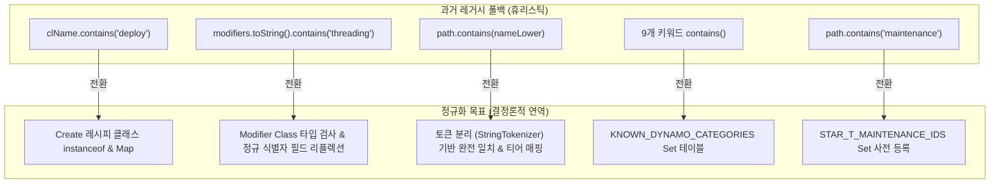
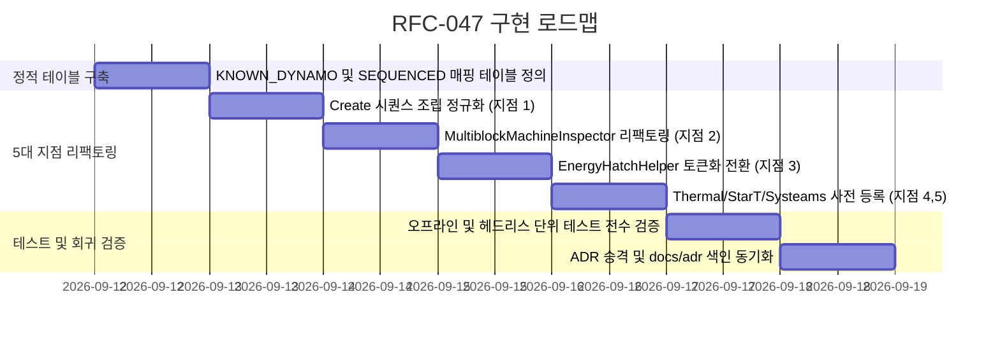

# RFC-047: 외부 모드 호환 계층 레거시 폴백 제거 및 Rule 5 결정론적 정규화 명세
# (Compat Layer Legacy Fallback Elimination & Rule 5 Deterministic Exact-Match Normalization Specification)

- **문서 번호**: RFC-047
- **대상 버전**: `v2.3.0`
- **상태**: `PROPOSED`
- **작성일**: 2026-09-11
- **최종 갱신일**: 2026-09-11
- **주관 계층**: Mod Compatibility Layer (`compat.create`, `compat.gtceu`, `compat.thermal`, `compat.start`, `compat.systeams`), Pure Domain Catalog (`api.catalog`)

---

## 1. 개요 및 배경 (Motivation)

### 1.1 현황 분석
`GregTech Calculator Board`는 [`.agents/AGENTS.md`](file:///d:/dev-ssd/modding/minecraft/GregTechCalculatorBoard/.agents/AGENTS.md)의 **Rule 5 (Addon & Spec Deductive Analysis Policy)**에 따라, 아이템 이름이나 ID 경로 문자열의 부분 일치(`contains`)를 통한 휴리스틱 추론을 엄격히 금지하고 있습니다.

최근 3대 서브에이전트 아키텍처 전수 감사(Full Scan) 결과, 런타임 주 경로는 공식 API, 런타임 리플렉션, 및 NBT 직접 검사를 준수하고 있으나, **오프라인 테스트, 미등록 커스텀 아이템 처리, 또는 과거 버전(`v2.0`~`v2.1`)에서 작성된 5개 레거시 폴백(Fallback) 경로에 문자열 `contains` 검사가 잔존함**이 식별되었습니다.

### 1.2 문제점 분석 대상 (5개 레거시 지점)
1. **Create 시퀀스 조립 단계별 기계 아이콘 연역 (`CreateSequencedRecipeExtractor:L232-L254`)**:
   - `clName.contains("deploy")`, `clName.contains("fill")` 등 클래스명 및 경로 문자열 부분 일치 의존.
2. **스레딩 모디파이어 객체 판별 (`MultiblockMachineInspector:L218-L219`)**:
   - `modifiers.toString().toLowerCase().contains("threading_machine")`과 같이 객체 문자열 변환 후 부분 일치 검사.
3. **에너지 해치 전압 티어 연역 오프라인 폴백 (`EnergyHatchHelper:L379`)**:
   - GT 레지스트리 미조회 환경(단위 테스트)에서 `path.contains(nameLower)` 부분 일치 의존.
4. **서멀 다이내모 판별 키워드 (`ThermalAugmentHelper:L248-L250`)**:
   - `TagKey` 미보유 시 9개 키워드(`fuel`, `dynamo`, `lapidary` 등) `contains` 검사.
5. **스타테크 유지보수 해치 및 시스팀스 배수 판별 (`StarTAddonCrawler`, `SysteamsRecipeHandler`)**:
   - `path.contains("maintenance")`, `cleaned.contains("stirling")` 부분 일치 의존.

### 1.3 설계 목표
- 5개 지점의 문자열 `contains` 휴리스틱을 완전 제거합니다.
- `ResourceLocation` 기반의 **완전 일치 테이블(`Set<ResourceLocation>`, `Map<ResourceLocation, T>`)** 및 **강타입 클래스 검사(`instanceof`, `Class<?>`)**로 100% 전환합니다.
- 모드팩 커스텀 아이템 및 다국어/네이밍 변경 환경에서도 시스템이 예측 가능하고 결정론적(Deterministic)으로 동작하도록 보장합니다.

---

## 2. 핵심 유저 스토리 (User Stories)

| 구분 | 플레이어 및 시스템 액션 | 기대 결과 |
|---|---|---|
| **US-01** | 모드팩 제작자가 Create 시퀀스 조립의 Deployer 단계를 커스텀 이름의 아이템으로 교체함 | 클래스명/경로 휴리스틱 없이 공식 RecipeSerializer Exact Match로 기계 아이콘이 정확히 매핑됨 |
| **US-02** | 플레이어가 Star Technology의 모듈러 스레딩 멀티블록을 캔버스에 배치함 | `toString()` 검사 없이 모디파이어 클래스 타입 기반으로 정확한 병렬 배수가 산출됨 |
| **US-03** | 엔지니어가 GT 레지스트리가 없는 오프라인 단위 테스트 환경에서 에너지 해치 티어를 검증함 | `contains` 오인식 없이 언더스코어 토큰 분리 완전 일치 테이블로 결정론적 티어가 반환됨 |

---

## 3. 시스템 아키텍처 및 상세 설계 (Architecture & Detailed Design)

### 3.1 5개 지점 정규화 규격



---

## 4. 세부 구현 상세 (Implementation Details)

### 4.1 지점 1: Create 시퀀스 조립 기계 아이콘 연역 (`CreateSequencedRecipeExtractor`)
```java
// 기존: String contains("deploy"), contains("fill")
// 변경: 공식 클래스 및 직렬화기 ID 완전 일치 매핑
private static final Map<ResourceLocation, ResourceLocation> SEQUENCED_STEP_MACHINES = Map.of(
    ResourceLocation.tryParse("create:deploying"), ResourceLocation.tryParse("create:deployer"),
    ResourceLocation.tryParse("create:filling"), ResourceLocation.tryParse("create:spout"),
    ResourceLocation.tryParse("create:pressing"), ResourceLocation.tryParse("create:mechanical_press"),
    ResourceLocation.tryParse("create:cutting"), ResourceLocation.tryParse("create:mechanical_saw")
);

public static ResourceLocation resolveMachineForStep(Recipe<?> subRecipe) {
    if (subRecipe instanceof DeployerApplicationRecipe) return ResourceLocation.tryParse("create:deployer");
    if (subRecipe instanceof FillingRecipe) return ResourceLocation.tryParse("create:spout");
    if (subRecipe instanceof PressingRecipe) return ResourceLocation.tryParse("create:mechanical_press");
    if (subRecipe instanceof CuttingRecipe) return ResourceLocation.tryParse("create:mechanical_saw");

    ResourceLocation serializerId = BuiltInRegistries.RECIPE_SERIALIZER.getKey(subRecipe.getSerializer());
    return SEQUENCED_STEP_MACHINES.getOrDefault(serializerId, ResourceLocation.tryParse("create:deployer"));
}
```

### 4.2 지점 2: 스레딩 모디파이어 객체 판별 (`MultiblockMachineInspector`)
```java
// 기존: modifiers.toString().toLowerCase().contains("threading")
// 변경: 컬렉션 내부 요소의 클래스 타입 직접 검사
private static boolean isThreadingModifier(Object modifier) {
    if (modifier == null) return false;
    Class<?> clazz = modifier.getClass();
    String simpleName = clazz.getSimpleName();
    return "ThreadingMachineRecipeModifier".equals(simpleName)
            || "StartRecipeModifiers$Threading".equals(simpleName);
}
```

### 4.3 지점 3: 에너지 해치 오프라인 티어 판별 (`EnergyHatchHelper`)
```java
// 기존: path.contains(nameLower)
// 변경: 언더스코어 토큰 분리 후 토큰 완전 일치 검사
private static int matchTierFromPathTokens(String path) {
    String[] tokens = path.toLowerCase(Locale.ROOT).split("[._/]");
    for (String token : tokens) {
        Integer tier = TIER_NAME_TO_INT.get(token);
        if (tier != null) return tier;
    }
    return -1;
}
```

### 4.4 지점 4: 서멀 다이내모 판별 키워드 (`ThermalAugmentHelper`)
```java
// 기존: 9개 키워드 contains()
// 변경: 공식 Known Categories 테이블 우선 검사
private static final Set<ResourceLocation> KNOWN_DYNAMO_CATEGORIES = Set.of(
    ResourceLocation.tryParse("thermal:dynamo_stirling"),
    ResourceLocation.tryParse("thermal:dynamo_compression"),
    ResourceLocation.tryParse("thermal:dynamo_magmatic"),
    ResourceLocation.tryParse("thermal:dynamo_numismatic"),
    ResourceLocation.tryParse("thermal:dynamo_lapidary"),
    ResourceLocation.tryParse("thermal:dynamo_disenchantment"),
    ResourceLocation.tryParse("thermal:dynamo_gourmand")
);
```

---

## 5. 구현 로드맵 (Phased Implementation)


