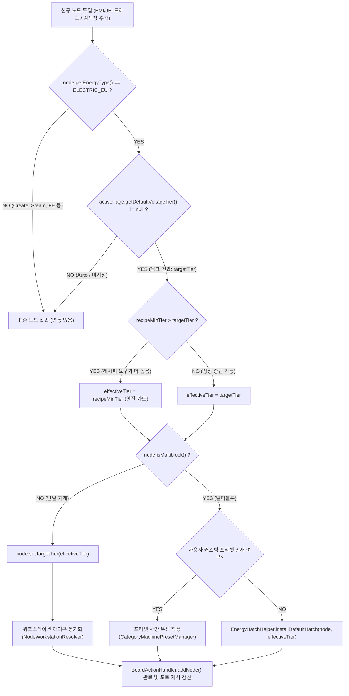
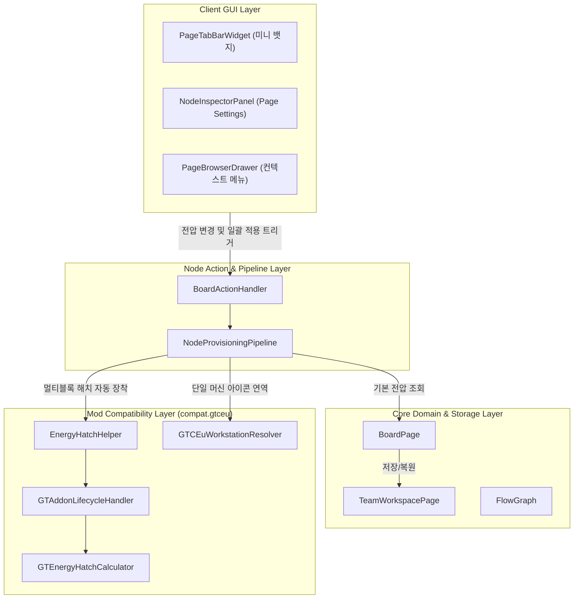
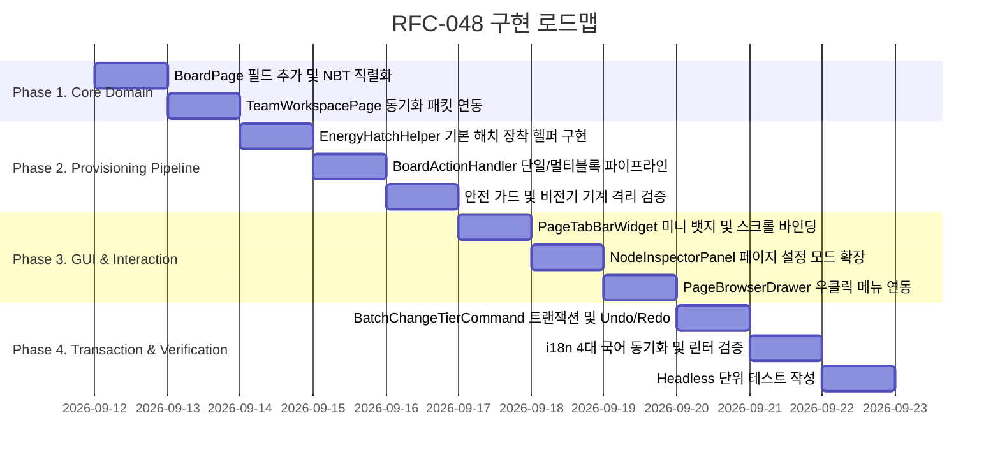

# RFC-048: 페이지별 목표 전압 티어 및 멀티블록 에너지 해치 자동 프로비저닝 명세
# (Page Target Voltage Tier & Multiblock Energy Hatch Auto-Provisioning Specification)

- **문서 번호**: RFC-048
- **대상 버전**: `v2.3.0`
- **상태**: `PROPOSED`
- **작성일**: 2026-09-12
- **최종 갱신일**: 2026-09-12
- **주관 계층**:
  - Core Domain & Storage Layer (`api.storage.BoardPage`, `api.model.FlowGraph`)
  - Node Insertion & Action Pipeline Layer (`client.gui.action.BoardActionHandler`)
  - Machine Addon & Mod Adapter Layer (`compat.gtceu.helper`, `compat.gtceu.handler`)
  - Client GUI & Interaction Layer (`client.gui.widget.PageTabBarWidget`, `client.gui.widget.NodeInspectorPanel`, `client.gui.widget.PageBrowserDrawer`)

---

## 1. 개요 및 배경 (Motivation)

### 1.1 현황 분석
GregTech Calculator Board는 마인크래프트 내에서 다중 페이지(탭/시트) 단위로 독립적인 공정 흐름을 설계할 수 있는 기능을 제공합니다. 플레이어들은 실제 게임 플레이 시 공정의 성격과 시대(Tier)에 따라 시트(페이지)를 분할하여 관리합니다 (예: "LV 원목 건식 증류", "EV 폴리에틸렌 화학 공정", "IV 티타늄 제련 라인").

그러나 현재 구현에서 EMI/JEI 또는 검색창을 통해 레시피 노드를 캔버스에 추가할 때, 시스템은 항상 **해당 레시피의 최소 요구 전압(Recipe Minimum Tier, 보통 LV/MV)**을 기준으로 노드를 생성합니다.

### 1.2 문제점 분석

1. **반복적인 미세 조작 피로 (Repetitive Scroll Fatigue)**:
   - 15~20개의 노드로 구성된 고티어(EV, IV, LuV 등) 공정 라인을 설계할 때, 플레이어는 레시피를 보드에 끌어다 놓을 때마다 노드 컨트롤 뱃지 위에서 마우스 휠을 2~4회씩 반복 스크롤하여 목표 전압까지 오버클록을 올려야 합니다.
   - 단일 공정 시트를 완성하기 위해 수십 회의 불필요한 마우스 휠 조작이 강제됩니다.

2. **멀티블록 기계의 전력 해치 장착 병목 (Multiblock Energy Hatch Bottleneck)**:
   - 단일 블록 기계는 `targetTier` 변경만으로 즉시 승급되지만, 전기 고로(EBF), 대형 화학 반응기(LCR) 등 핵심 멀티블록 기계는 **장착된 에너지 해치(`GTEnergyHatchAddon`)의 티어에 의해 노드의 전압이 고정(`tier_locked_by_energy_hatch`)**됩니다.
   - 현재 멀티블록 노드가 생성되면 에너지 해치가 누락되거나 최소 티어로만 생성되므로, 오버클록을 적용하려는 플레이어는 노드마다 **애드온 설정 다이얼로그(`AddonConfigDialog`) 열기 $\rightarrow$ 에너지 해치 탭 이동 $\rightarrow$ 원하는 티어의 해치 검색/선택 $\rightarrow$ 장착**이라는 4단계 수동 조작을 매번 반복해야 합니다.

3. **시트 단위 목표 전압 멘탈 모델 부재**:
   - 엑셀 시트와 유사하게 "이 시트는 EV 규격 라인이다"라는 페이지 수준의 정책(Context)을 선언할 방법이 없어, 노드 단위의 개별 조작에 전적으로 의존하고 있습니다.

### 1.3 설계 목표

1. **페이지 단위 목표 전압 선언 (`BoardPage.defaultVoltageTier`)**:
   - 각 페이지에 기본 목표 전압 티어를 지정할 수 있는 도메인 속성을 추가합니다 (기본값: `null` = Auto / 기존 레시피 최소 티어 동작 유지, 100% 하위 호환).
2. **단일 기계 및 멀티블록 통합 자동 프로비저닝 (Unified Auto-Provisioning Pipeline)**:
   - 페이지에 목표 전압이 설정된 상태에서 노드를 추가할 경우:
     - 단일 기계: 목표 전압으로 자동 오버클록 및 해당 티어 워크스테이션 아이콘 동기화.
     - 멀티블록 기계: 목표 전압에 부합하는 `GTEnergyHatchAddon`을 1개 자동 장착하여 즉시 풀 오버클록 수치로 연산.
3. **결정론적 안전 가드 (Deterministic Safety Guards)**:
   - 레시피의 최소 요구 전압이 페이지 목표 전압보다 높은 경우(예: 페이지는 EV인데 레시피는 IV 요구), 레시피의 최소 요구 조건을 보존하여 다운그레이드로 인한 가동 불가 결손을 방지합니다.
   - 비전기 기계(Create 회전 운동, 스팀 기계, 바닐라 화로 등)는 해당 전압 파이프라인에서 완전히 격리합니다.
4. **기존 노드 일괄 승급 (Batch Apply Action & Transaction)**:
   - 페이지 내 이미 배치된 노드들을 단일 클릭으로 현재 페이지 전압에 맞추어 일괄 승급/교체할 수 있는 트랜잭션 커맨드를 지원합니다 (Undo/Redo 지원).
5. **시각적 비침투성 UI (Non-Intrusive Minimalist UI)**:
   - 상단 탭 바의 상시 복잡도를 유발하지 않도록, `Auto` 상태에서는 UI를 숨기고 명시적 설정 시에만 미니멀 뱃지(`[⚡ EV]`)를 노출합니다.
   - 빈 캔버스 선택 시 우측 인스펙터를 페이지 설정 모드로 전환하여 직관적인 조작 패널을 제공합니다.

---

## 2. 핵심 유저 스토리 (User Stories)

| 식별자 | 플레이어 액션 | 시스템 동작 및 기대 결과 |
| :--- | :--- | :--- |
| **US-01** | 플레이어가 새 페이지를 생성하고 목표 전압을 `EV`로 지정합니다. | 페이지 탭 이름 옆에 작은 `[⚡ EV]` 뱃지가 조용히 표시되며, 페이지 메타데이터에 EV 전압이 기록됩니다. |
| **US-02** | 플레이어가 EMI에서 LV 화학 반응기 레시피를 EV 페이지로 드래그 앤 드롭합니다. | 레시피 최소 요구 티어(LV) $\le$ 페이지 목표 전압(EV)이므로, 노드가 생성됨과 동시에 `targetTier`가 `EV`로 오버클록되고 아이콘이 `gtceu:ev_chemical_reactor`로 자동 설정됩니다. |
| **US-03** | 플레이어가 EV 페이지에 전기 고로(EBF, MV 레시피)를 배치합니다. | 시스템이 멀티블록임을 감지하고 자동으로 `gtceu:ev_energy_hatch`를 1개 장착하여 노드 전압을 EV로 잠그고 4배 오버클록 수치를 즉시 계산합니다. 애드온 다이얼로그를 수동으로 열 필요가 없습니다. |
| **US-04** | 플레이어가 EV 페이지에 IV 요구 레시피(예: 플래티넘 정제)를 배치합니다. | 레시피 요구 전압(IV) $>$ 페이지 전압(EV)이므로, 안전 가드가 작동하여 다운그레이드 없이 `IV` 전압 및 `gtceu:iv_energy_hatch`가 안전하게 적용됩니다. |
| **US-05** | 플레이어가 Create 분쇄 휠 또는 스팀 보일러 레시피를 EV 페이지에 배치합니다. | `EnergyType`이 `ELECTRIC_EU`가 아니므로 페이지 전압 로직이 개입하지 않고 고유 모드 사양(RPM/스팀 모드)을 그대로 유지합니다. |
| **US-06** | 플레이어가 HV 공정 페이지에서 목표 전압을 EV로 변경하고 `[기존 노드 일괄 적용]`을 누릅니다. | 페이지 내 모든 단일 기계의 티어가 EV로 승급되고, 멀티블록의 HV 에너지 해치가 EV 해치로 일괄 교체됩니다. 단 한 번의 `Ctrl+Z`로 일괄 변경 전 상태로 완벽히 되돌릴 수 있습니다. |

---

## 3. 시스템 아키텍처 명세 (Architecture Specification)

### 3.1 노드 추가 및 자동 프로비저닝 파이프라인



---

### 3.2 계층별 모듈 책임 구조



---

## 4. 상세 설계 및 알고리즘 (Detailed Design & Algorithms)

### 4.1 도메인 모델 확장 (`BoardPage`)

`BoardPage`에 페이지 전압 티어 필드를 추가하고 NBT 직렬화/역직렬화를 구현합니다:

```java
public class BoardPage {
    // null: Auto (기존 동작, 레시피 자체 티어로 생성)
    private GTVoltageTier defaultVoltageTier = null;

    public GTVoltageTier getDefaultVoltageTier() {
        return defaultVoltageTier;
    }

    public void setDefaultVoltageTier(GTVoltageTier tier) {
        this.defaultVoltageTier = tier;
    }

    // CompoundTag serializeNBT() 내부
    if (defaultVoltageTier != null) {
        tag.putString("defaultVoltageTier", defaultVoltageTier.name());
    }

    // deserializeNBT(CompoundTag tag) 내부
    if (tag.contains("defaultVoltageTier")) {
        try {
            page.defaultVoltageTier = GTVoltageTier.valueOf(tag.getString("defaultVoltageTier"));
        } catch (IllegalArgumentException ignored) {}
    }
}
```

---

### 4.2 멀티블록 에너지 해치 프로비저닝 로직 (`EnergyHatchHelper`)

멀티블록 기계에 지정된 티어의 표준 1x 에너지 해치를 자동으로 장착하는 헬퍼 메서드를 추가합니다:

```java
public static boolean installDefaultEnergyHatch(RecipeNode node, GTVoltageTier targetTier) {
    if (node == null || targetTier == null || !node.isMultiblock()) return false;
    if (!GTEnergyHatchCalculator.requiresEnergyHatch(node)) return false;

    // 기존에 장착된 에너지 해치 제거
    node.getAddons().removeIf(a -> a.getCategory() == MachineAddon.Category.ENERGY_HATCH);

    // targetTier에 부합하는 정규 에너지 해치 식별
    ResourceLocation hatchId = getDefaultHatchIdForTier(targetTier);
    if (hatchId == null) return false;

    GTEnergyHatchAddon addon = createEnergyHatchAddon(hatchId, targetTier, 1);
    GTAddonLifecycleHandler.onAddonInstalled(node, addon);
    return true;
}
```

- **식별 규칙**:
  - `ULV` ~ `MAX`에 대응하는 기본 GTCEu 에너지 해치 ID(`gtceu:<tier>_energy_hatch`)를 1:1 매핑합니다.
  - 외부 애드온 모드팩에서 커스텀 해치만 존재하는 경우, `EnergyHatchHelper.STATS_CACHE`에 등록된 해치 중 지정 티어 & 1A/2A 정규 해치를 결정론적으로 추출합니다.

---

### 4.3 기존 노드 일괄 승급 트랜잭션 (`BatchChangeTierCommand`)

플레이어가 `[기존 노드 일괄 적용]`을 실행할 때, 개별 노드 수정을 단일 트랜잭션으로 묶어 원자적 Undo/Redo를 보장합니다:

```java
public class BatchChangeTierCommand implements BoardCommand {
    private final String pageId;
    private final GTVoltageTier targetTier;
    private final List<NodeTierSnapshot> previousSnapshots = new ArrayList<>();

    public record NodeTierSnapshot(String nodeId, GTVoltageTier oldTier, ResourceLocation oldIcon, List<MachineAddon> oldAddons) {}

    @Override
    public void execute(FlowGraph graph) {
        // 대상 노드들 중 승급 가능한 노드 필터링 및 이전 상태 캡처 후 일괄 교체
    }

    @Override
    public void undo(FlowGraph graph) {
        // 캡처된 스냅샷으로 정확히 복원
    }
}
```

---

## 5. UI / UX 디자인 상세 (UI/UX Specification)

### 5.1 상단 탭 바 (Page Tab Bar) 미니멀 뱃지

상단 탭 바(`PageTabBarWidget`)에 불필요한 시각적 복잡도를 주지 않도록 **조건부 미니멀 렌더링**을 적용합니다:

```
[ Auto 상태 (기본값) ]
+-------------------------+
| ▪ Main Factory        ✕ |  <- 전압 뱃지 미노출 (탭 공간 100% 보존)
+-------------------------+

[ EV 전압 설정 상태 ]
+--------------------------------+
| ▪ Polyethylene Line  ⚡EV   ✕ |  <- 16x12 미니 뱃지 표시
+--------------------------------+
```

- **인터랙션**:
  - `⚡EV` 미니 뱃지 영역에서 **마우스 휠 스크롤 또는 좌클릭**:
    `Auto` $\rightarrow$ `ULV` $\rightarrow$ `LV` $\rightarrow$ `MV` $\rightarrow$ `HV` $\rightarrow$ `EV` $\rightarrow$ `IV` $\rightarrow$ ... $\rightarrow$ `Auto` 순환 변경.
  - 뱃지 툴팁:
    - `"§e⚡ 목표 전압: §fEV"`
    - `"§7[스크롤/클릭]: 전압 티어 순환 변경"`
    - `"§7[우클릭]: 상세 페이지 설정 열기"`

---

### 5.2 빈 캔버스 선택 시 우측 인스펙터 (`PageSettings` 패널)

노드를 선택하지 않고 빈 캔버스 배경을 클릭했을 때, 우측 `NodeInspectorPanel`이 `PageSettings` 모드로 전환됩니다:

```
+------------------------------------+
| 📄 페이지 설정 (Page Settings)     |
+------------------------------------+
| 페이지 이름: [Polyethylene Line  ] |
| 소속 폴더:   [Chemical / Plastics] |
+------------------------------------+
| ⚡ 기본 목표 전압 (Target Voltage)  |
| [ Auto (레시피 기본값)         ▼ ] |
|  - Auto                            |
|  - LV (32 EU/t)                    |
|  - MV (128 EU/t)                   |
|  - HV (512 EU/t)                   |
|  - EV (2,048 EU/t)         <선택>  |
|  - IV (8,192 EU/t)                 |
|  - ...                             |
+------------------------------------+
| ⚙ 멀티블록 해치 정책                |
| [✔] 목표 전압 에너지 해치 자동 장착|
+------------------------------------+
| [ ⚡ 기존 노드 일괄 적용 (12개)  ] |
+------------------------------------+
```

---

### 5.3 페이지 브라우저 드로어 우클릭 메뉴 (`PageBrowserDrawer`)

페이지 탭 또는 좌측 브라우저에서 페이지 우클릭 시 컨텍스트 메뉴에 전압 항목을 노출합니다:
- `[★ 즐겨찾기 고정]`
- `[✎ 이름 변경]`
- `[⚡ 목표 전압 설정...]` $\rightarrow$ 전압 선택 서브메뉴
- `[⚡ 현재 전압으로 기존 노드 일괄 적용]`
- `[✕ 페이지 삭제]`

---

## 6. 다국어 리소스 (i18n) 동기화 규격

`tools/check_i18n.py` 기준 4대 언어(`en_us`, `ko_kr`, `zh_cn`, `ru_ru`)에 동일하게 반영될 키 규격입니다. 유니코드 이형 선택자(VS16)는 엄격히 배제합니다.

| 언어 키 | 영어 (en_us) | 한국어 (ko_kr) |
| :--- | :--- | :--- |
| `gui.gtcalcboard.page_settings.title` | Page Settings | 페이지 설정 |
| `gui.gtcalcboard.page_settings.target_voltage` | Target Voltage | 기본 목표 전압 |
| `gui.gtcalcboard.page_settings.target_voltage_auto` | Auto (Recipe Default) | Auto (레시피 기본값) |
| `gui.gtcalcboard.page_settings.autohatch_toggle` | Auto-equip Energy Hatches for Multiblocks | 멀티블록 에너지 해치 자동 장착 |
| `gui.gtcalcboard.page_settings.apply_to_existing` | Apply Target Voltage to All Nodes (%d) | 기존 모든 노드에 목표 전압 적용 (%d개) |
| `gui.gtcalcboard.page_settings.apply_success_toast` | Applied %s tier to %d nodes | %d개 노드에 %s 티어를 적용했습니다 |
| `gui.gtcalcboard.page_settings.badge_tooltip_title` | Page Target Voltage: %s | 페이지 목표 전압: %s |
| `gui.gtcalcboard.page_settings.badge_tooltip_cycle` | [Click / Scroll]: Cycle voltage tier | [클릭 / 스크롤]: 전압 티어 순환 변경 |

---

## 7. 단계별 개발 로드맵 (Phased Implementation)



---

## 8. 대안 비교 및 미채택 사유 (Alternative Analysis)

1. **대안 A: 전역 환경설정(`BoardSettingsDialog`)에 기본 전압 배치**:
   - *미채택 사유*: 전압은 보드 전체가 아니라 공정 시트(페이지) 단위로 완전히 달라지므로(예: 1페이지는 LV, 2페이지는 EV), 전역 설정에 두면 시트 전환 시마다 설정을 매번 뜯어고쳐야 하므로 부적합합니다.
2. **대안 B: 상단 탭 바 상시 대형 드롭다운 배치**:
   - *미채택 사유*: 탭 바의 가로 공간을 과도하게 차지하여 작은 화면 및 다중 탭 환경에서 시각적 공해가 심해집니다. 미니멀 뱃지 + 인스펙터 패널 조합이 훨씬 우수합니다.
3. **대안 C: 멀티블록 해치를 무조건 듀얼 해치(2x)로 장착**:
   - *미채택 사유*: 듀얼 해치는 +1티어 오버클록을 일으켜 전력 계산이 4배 더 커지므로, 표준적인 정규 전압(1x)을 기본값으로 두고 필요 시 유저가 조정할 수 있도록 하는 것이 안전합니다.
